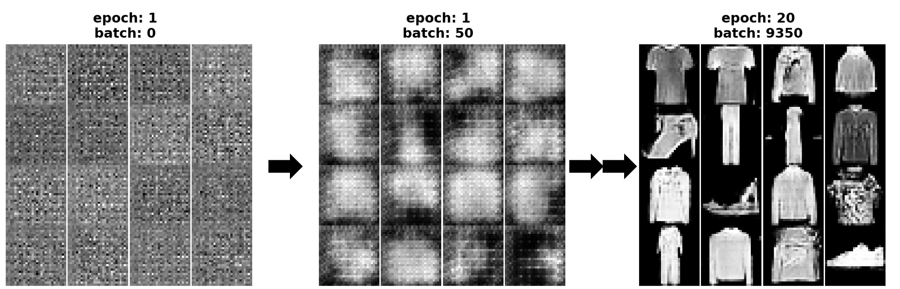
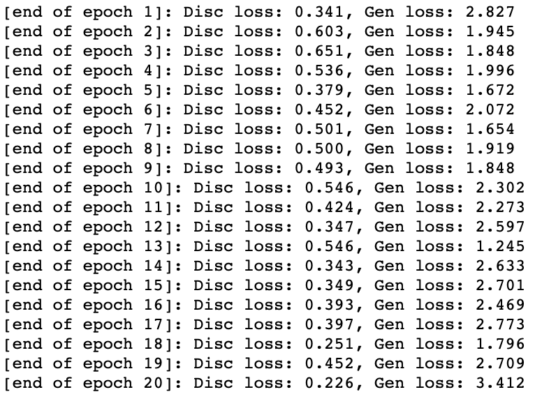
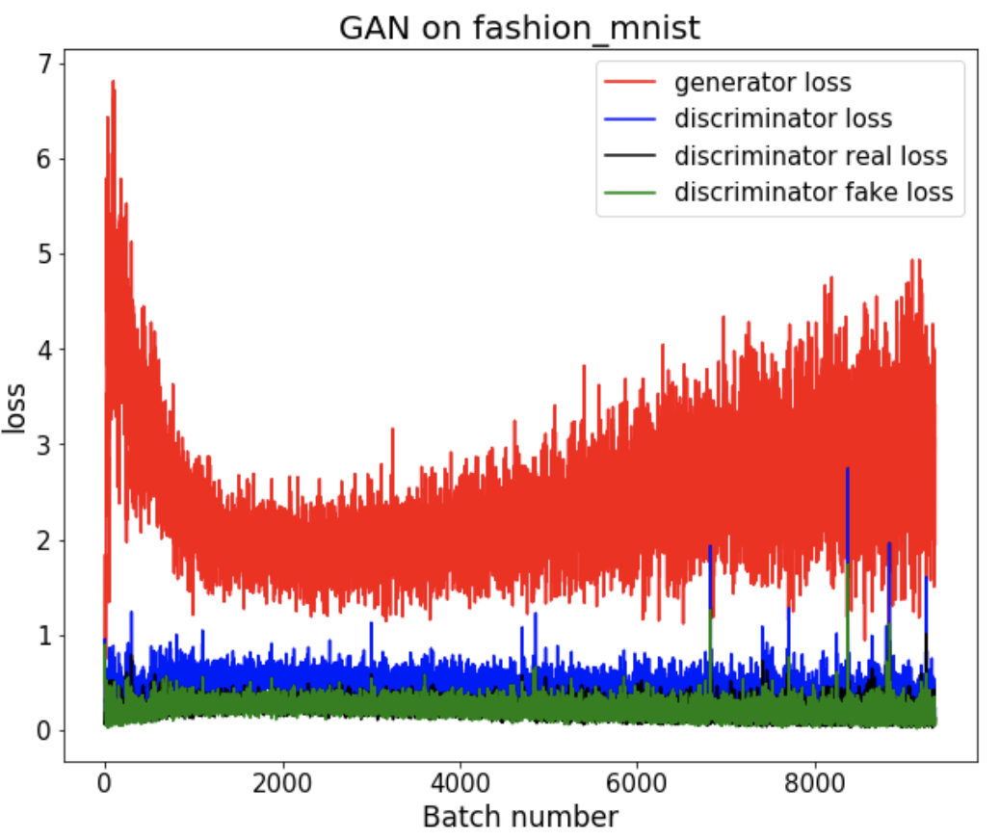
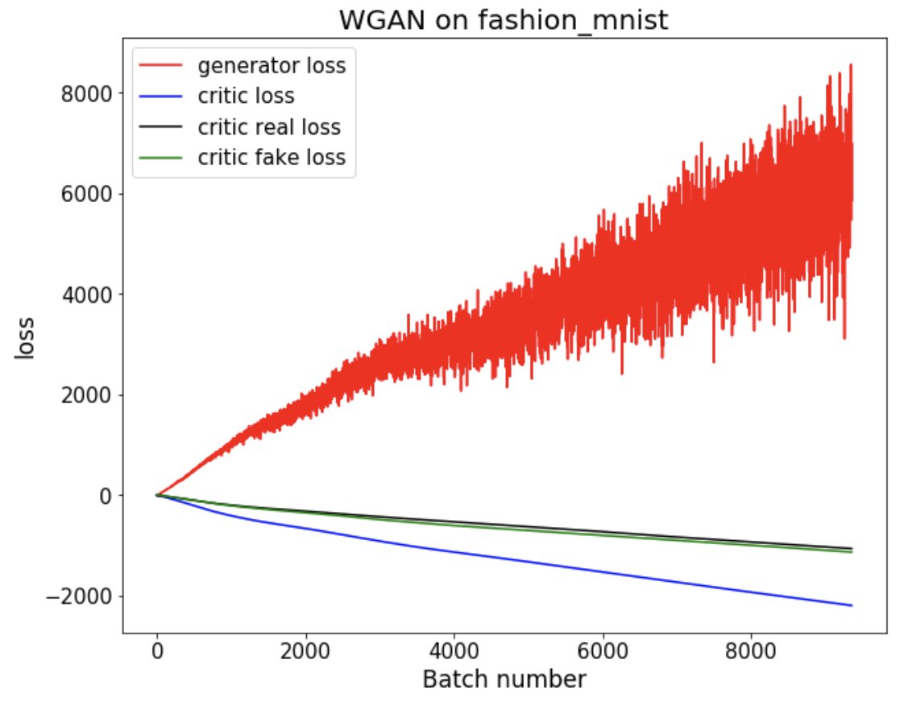
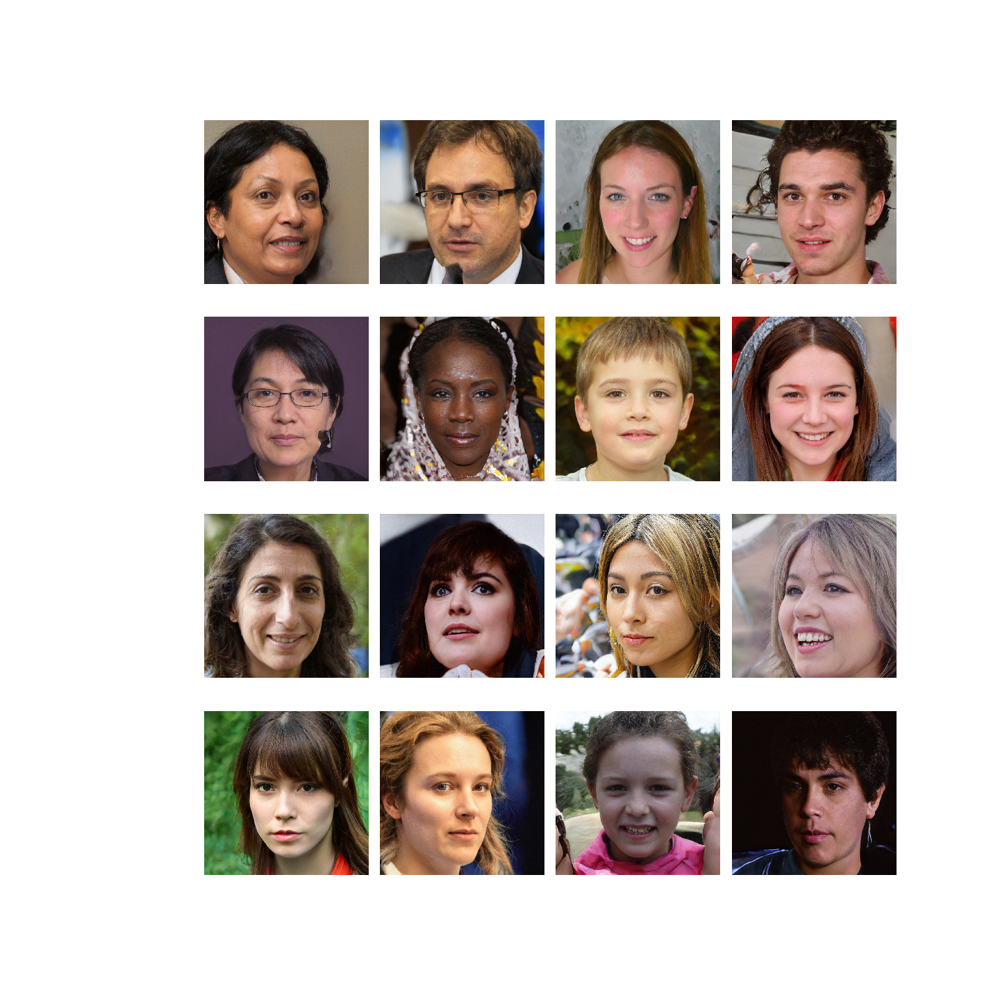

# Exploring GAN, WGAN and StyleGAN

**GAN (Generative and Adversarial Network)** is one of the recent technologies in the field of deep learning that is pushing the threshold of deep-learning-based generative models in many different domains such as images and sounds. GAN is a powerful generative model as it can learn the general distribution of given data in a highly effective way. Since its [first introduction in 2014](https://arxiv.org/pdf/1406.2661.pdf), there has been a number of [interesting variations/applications](https://github.com/nashory/gans-awesome-applications#anime-character-generation) made from GAN. This article would like to explore the theoretical backgrounds of the basic GAN model (in terms of images) and introduce practical code examples to generate the fashion_MNIST-like images from scratch. At the end of this article, WGAN (Wasserstein Generative and Adversarial Network) and NVIDIA's StyleGan will be briefly introduced as well.

Gan is composed of a pair of neural networks that:

* Generates images from a random vector ***(generator)***
* Differentiates fake (from a generator) and real (from the unlabeled dataset) images ***(discriminator)***

The two neural networks can be a regular DNN-structure, but when handling images, CNN-structure is easily implemented in both networks. With CNN architectures, GAN is usually referred to as **DCGAN** (Deep Convolutional Generative and Adversarial Network). Before introducing the overall structure of GAN, it would be necessary to understand the difference between generative and discriminative algorithms in general.

### Ways to describe a *Generative algorithm*

* learns to predict/reconstruct (latent) features ***x*** given labels ***y***
* obtains the probability of features ***x*** given labels ***y*** (or P(x|y))
* models the distribution of labels ***y***

### Ways to describe a *discriminative algorithm*

* learns to classify the input data
* learns to predict labels ***y*** given features ***x***
* obtains the probability of labels ***y*** given features ***x*** (or P(y|x))
* maps features ***x*** to labels ***y***
* models the boundary between labels ***y*** 

## Training of GAN

The training process of GAN is composed of two parts.

The first part is to train a ***discriminator***. Since we are only interested to determine if the given image is real or fake, all the real images are labelled as 1 and all the fake images are labelled as 0. At this point where the generator is not yet trained at all, all the fake images will be just a bunch of noise. The discriminator learns to classify the real and the fake images quite easily.

The second part is to train the entire model where a generator and a discriminator are stacked together. It should be noted that, however, the weights of the discriminator must not be updated during this part of training so that only the ***generator*** gets trained. The generator tries to mimic the data distribution of the real images so that it receives a large classification error from the following discriminator.

As training proceeds, both models get better and better at their jobs in an adversarial manner: **generator** gets better at producing realistic images to fool discriminator --> **discriminator** gets better at classifying the true real images and the realistic fake images from generator --> **generator** gets better .. --> **discriminator** gets better --> ... In other words, the discriminator and the adversarial (or generator) models are trained simultaneously to reach a Nash equilibrium.

<p align="center"></p>


## GAN example on Fashion_MNIST

The full code of this GAN example can be found in [***this repository***](https://github.com/sungsujaing/ML_DL_articles_resources/blob/master/Code%20appendix/Fashion_image_generator_using_GAN%20and%20WGAN.ipynb).

### Import modules and define configurations

```python
from keras.datasets import fashion_mnist
from keras.layers import Input,Dense,Reshape,Flatten,Dropout,BatchNormalization,Activation
from keras.layers.advanced_activations import LeakyReLU
from keras.layers.convolutional import Conv2D,Conv2DTranspose
from keras.models import Model,Sequential
from keras.optimizers import Adam
from keras.initializers import RandomNormal
from keras import backend
import matplotlib.pyplot as plt
%matplotlib inline
import numpy as np

img_rows = 28 # (1)
img_cols = 28
channels = 1
img_shape = (img_rows,img_cols,channels)
latent_dim = 100 # (2)
```

(1) the size of real images determines the target shape of fake images

(2) the size of latent vector space

From various open-source projects online, the following hyperparameters were chosen to maximize the performance of GAN.

- Activation: *LeakyReLU* for Generator and Discriminator
- Initialization: Gaussian (mean: 0, std: 0.02)
- Optimizer: Adam (lr: 0.0002, beta_1: 0.5)
- For downsampling: Use (2,2) strides, instead of typical maxpooling
- For upsampling: Use (2,2) strides

### Define generator and discriminator

```python
## Generator
model_gen = Sequential()
init = RandomNormal(mean=0.0, stddev=0.02)
model_gen.add(Dense(7*7*256,kernel_initializer=init,use_bias=False,input_dim=latent_dim))
model_gen.add(BatchNormalization(momentum=0.8))
model_gen.add(LeakyReLU(alpha=0.2))
model_gen.add(Reshape((7,7,256)))
model_gen.add(Conv2DTranspose(128,3,strides=(1,1),padding='same',kernel_initializer=init,use_bias=False))
model_gen.add(BatchNormalization(momentum=0.8))
model_gen.add(LeakyReLU(alpha=0.2))
model_gen.add(Conv2DTranspose(64,3,strides=(2,2),padding='same',kernel_initializer=init,use_bias=False))
model_gen.add(BatchNormalization(momentum=0.8))
model_gen.add(LeakyReLU(alpha=0.2))
model_gen.add(Conv2DTranspose(channels,3,strides=(2,2),padding='same',kernel_initializer=init,use_bias=False))
model_gen.add(Activation('tanh'))

inputs_gen = Input(shape=(latent_dim,))
outputs_gen = model_gen(inputs_gen)
generator = Model(inputs_gen,outputs_gen)

## Discriminator
model_disc = Sequential()
init = RandomNormal(mean=0.0, stddev=0.02)
model_disc.add(Conv2D(32,3,strides=(2,2),padding='same',kernel_initializer=init,input_shape=img_shape))
model_disc.add(LeakyReLU(alpha=0.2))
model_disc.add(Dropout(0.25))
model_disc.add(Conv2D(64,3,strides=(2,2),padding='same',kernel_initializer=init))
model_disc.add(BatchNormalization(momentum=0.8))
model_disc.add(LeakyReLU(alpha=0.2))
model_disc.add(Dropout(0.25))
model_disc.add(Conv2D(128,3,strides=(2,2),padding='same',kernel_initializer=init))
model_disc.add(BatchNormalization(momentum=0.8))
model_disc.add(LeakyReLU(alpha=0.2))
model_disc.add(Dropout(0.25))
model_disc.add(Conv2D(256,3,strides=(1,1),padding='same',kernel_initializer=init))
model_disc.add(BatchNormalization(momentum=0.8))
model_disc.add(LeakyReLU(alpha=0.2))
model_disc.add(Dropout(0.25))
model_disc.add(Flatten())
model_disc.add(Dense(1,activation='sigmoid'))

inputs_disc = Input(shape=img_shape)
outputs_disc = model_disc(inputs_disc)
discriminator = Model(inputs_disc,outputs_disc)
```

### Build the adversarial model and compiling

```python
## discriminator model (training discriminator)
discriminator.compile(loss='binary_crossentropy',optimizer=optimizer)

## adversarial model (training generator)
fake_img = generator(inputs_gen)
discriminator.trainable = False # (1)
valid = discriminator(fake_img)
adver = Model(inputs_gen,valid)
adver.compile(loss='binary_crossentropy',optimizer=optimizer)
```

(1) freeze the discriminator to train only the generator in the adversarial model

### Training GAN

As described above, the training objects are:

- discriminator: to minimize the classification error
- generator: to maximize the classification error

This does not guarantee the model to converge. From various open-source projects online, the following hyperparameters were chosen to maximize the performance of GAN.

- Sample noise from a standard Gaussian distribution (mean: 0, std: 1)

```python
batch_size=128
noise_plot = np.random.normal(0,1,(batch_size,latent_dim)) #(1)
```

(1)  set the fixed random noise for plotting (this ensures the generated plots show gradual improvement of the same image over the training)

```python
def train(epochs,save_interval=50):
    (X_train,_),(_,_) = fashion_mnist.load_data() # (1)
    
    X_train = X_train.astype('float32')
    X_train = X_train/127.5-1. # (2)
    X_train = np.expand_dims(X_train,axis=3)
    
    disc_loss_real_list = []
    disc_loss_fake_list = []
    disc_loss_list = []
    gen_loss_list = []
    
    real = np.ones((batch_size,1)) # (3)
    fake = np.zeros((batch_size,1))
    
    batch_num = X_train.shape[0] / batch_size
    batch_num_perm_idx = np.random.permutation(int(batch_num))
    
    ## plot epoch 0
    rows,cols = 4,4
    fake_imgs_plot = generator.predict(noise_plot)
    fake_imgs_plot = (0.5*fake_imgs_plot) + 0.5 # (4)
    fig,axes = plt.subplots(rows,cols,figsize=(10,10))
    plt.suptitle('epoch: 1\nbatch: 0',fontsize=30,fontweight='bold')
    img_num=0
    for i in range(rows):
        for j in range(cols):
            axes[i,j].imshow(fake_imgs_plot[img_num,:,:,0],cmap='gray')
            axes[i,j].axis('off')
            img_num += 1
    plt.subplots_adjust(wspace=0, hspace=0)
    fig.savefig('GAN_images/fmnist_1_0.png')
    plt.close()
    
    for epoch in range(epochs):
        for batch_count_per_epoch in range(int(batch_num)):
            # train discriminator: full batch from real and full batch from fake
            idx = list(range(batch_num_perm_idx[batch_count_per_epoch]*batch_size, (batch_num_perm_idx[batch_count_per_epoch]+1)*batch_size))
            imgs = X_train[idx]
            noise = np.random.normal(0,1,(batch_size,latent_dim)) #(5)
            fake_imgs = generator.predict(noise)

            #factor of 0.5 since we used 2 full batchs
            disc_loss_real = 0.5*discriminator.train_on_batch(imgs,real)
            disc_loss_fake = 0.5*discriminator.train_on_batch(fake_imgs,fake)
            disc_loss = np.add(disc_loss_real,disc_loss_fake) # need to minimize

            disc_loss_real_list.append(disc_loss_real)
            disc_loss_fake_list.append(disc_loss_fake)
            disc_loss_list.append(disc_loss)

            # train generator: full batch
            noise = np.random.normal(0,1,(batch_size,latent_dim))
            gen_loss = adver.train_on_batch(noise,real) ## need to maximize
            gen_loss_list.append(gen_loss)
            
            batch_count = epoch*int(batch_num)+batch_count_per_epoch+1
#             print('[epoch {} // step {}]: Disc loss: {:.3f}, Gen loss: {:.3f}'.format(epoch+1,batch_count,disc_loss,gen_loss))

            if batch_count % save_interval == 0: #(6)
                fake_imgs_plot = generator.predict(noise_plot)
                fake_imgs_plot = (0.5*fake_imgs_plot) + 0.5 #(4)

                fig,axes = plt.subplots(rows,cols,figsize=(10,10))
                plt.suptitle('epoch: {}\nbatch: {}'.format(epoch+1,batch_count),fontsize=30,fontweight='bold')
                img_num=0
                for i in range(rows):
                    for j in range(cols):
                        axes[i,j].imshow(fake_imgs_plot[img_num,:,:,0],cmap='gray')
                        axes[i,j].axis('off')
                        img_num += 1
                plt.subplots_adjust(wspace=0, hspace=0)
                fig.savefig('GAN_images/fmnist_{}_{}.png'.format(epoch+1,batch_count))
                plt.close()
        print('[end of epoch {}]: Disc loss: {:.3f}, Gen loss: {:.3f}'.format(epoch+1,disc_loss,gen_loss))
    return disc_loss_real_list,disc_loss_fake_list,disc_loss_list,gen_loss_list
```

(1) load only the data without the corresponding labels

(2) rescale real images to -1 to 1 since we are using tanh in the generator

(3) set arbitrary binary labels for real and fake images

(4) rescale images to 0 - 1 from -1 - 1 for plotting

(5) sample noise from latent vector and generate a full batch of fake images

(6) plot the generated images at the specified intervals

```python
disc_loss_real_list,disc_loss_fake_list,disc_loss_list,gen_loss_list = train(epochs=20,save_interval=50)
```

### Results

One of the most critical disadvantages of GAN is that the loss does not really correlate with the quality of the image generated as it simply measures how well the generated images trick the discriminator. It means that the learning process of GAN cannot be monitored by its loss metrics. The set of images need to be visually evaluated once in a while which can be highly subjective.

#### Training summary

<p align="center">
  
</p>

<p align="center">
  
  
</p>


#### Training over epochs (up to epoch 10)

<p align="center">
  
</p>


## WGAN example on Fashion_MNIST

**Wasserstein Generative and Adversarial Network (WGAN)**, an extension of GAN, utilizes a different loss function from GAN. WGAN, therefore, can be easily built upon the original GAN model with a few modifications. Wasserstein Distance, the loss function of WGAN, is a measure of the distance between two probability distributions and WGAN loss function reflects the image quality.

While the full codes to implement WGAN on Fashion_MNIST is presented [***HERE***](https://github.com/sungsujaing/ML_DL_articles_resources/blob/master/Code%20appendix/Fashion_image_generator_using_GAN%20and%20WGAN.ipynb), the critical modifications that define WGAN include:

- In WGAN, a discriminator is replaced by a critic to score the realness (or fakeness) of a given image, where the difference between the scores is as large as possible (WGAN encourages the critic to output scores that are different for real and fake images)
- Wasserstein loss to train the critic and generator models
- Use -1 label for real images and 1 label for fake images (or vice versa)
- Optimizer: RMSProp with no momentum (lr: 0.00005)

**Critic** (former discriminator)

- linear activation function in the top layer (instead of sigmoid)
- Clip the weights of a critic model to [-0.01,0.01] after each mini-batch update
- Update the critic model more times than the generator each iteration

### Results

<p align="center">
  
</p>

<p align="center">
  
</p>


## StyleGAN

Another very interesting extension of GAN includes [NVIDIA's StyleGAN](https://arxiv.org/pdf/1812.04948.pdf) introduced in 2018. StyleGAN generates extremely realistic images of human faces. The pre-trained model and weights are available in their repository and they can be used to generate the highly resolved fake human face images from Jupyter notebook. The full code to implement StyleGAN can be found [***HERE***](https://github.com/sungsujaing/ML_DL_articles_resources/blob/master/Code%20appendix/NVIDIA_style_GAN_face_gen_example.ipynb).

First, we need to clone the StyleGAN repository as:

`git clone https://github.com/NVlabs/stylegan.git`

#### Results

<p align="center">
  
</p>


