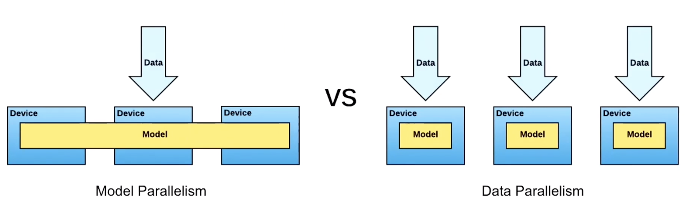

# Exploring distributed training with Keras and TensorFlow data module

In TensorFlow (`tf`), the ***Keras (`tf.keras`)*** API is highly user-friendly and is composed of configurable building blocks, allowing fast prototyping of the complex models without spending too much time/effort tweaking the error-prone details of the model architecture. This allows practitioners to focus more on the unique problems of their own without worrying too much about the backend details. The primary problems with such high-level APIs include compromised flexibility. While being good at simply building/training/evaluating/deploying models composed of basic layers and building blocks, they had difficulties in implementing advanced algorithms that require more precise control of the small details. However, it should be noted that practitioners can simply implement low-level APIs on top of high-level APIs in order to get full control over the models.  

Being integrated as a core high-level API (Application Programming Interface) in `tf`, `tf.keras` has gradually become compatible with many useful modules in TensorFlow without using low-level APIs. Among many, this article would explore how TensorFlow's **`tf.data`** and **`tf.distribute.Strategy`** APIs can be used with `tf.keras` to build efficient data input pipelines and to enable distributed training using existing user-friendly `tf.keras` models/codes with minimal changes.

## what is [tf.distribute.Strategy](http://www.tensorflow.org/guide/distribute_strategy) module for?

When a relatively small amount of data is on hand to train a relatively simple model with a single processing unit (CPU, GPU or TPU), training may not take too much time and a practitioner can go through several rounds of trial-and-errors to optimize their models. When the amount of data gets bigger or the model gets complicated, training becomes computationally expensive and the corresponding training may take a few hours, days, even weeks, making the overall model development process very inefficient. The solution is ***distributed training*** or going parallel with multiple processing units (or even workers)! There are two general types of parallelism:

* Model Parallelism: when the model is too large
* Data Parallelism: when the given data is too large

<p align="center"></p>

source: [(Uber Open Summit 2018) Horovod: Distributed Deep Learning in 5 Lines of Python](https://www.youtube.com/watch?v=4y0TDK3KoCA&t=1311s)

However, it should be noted that the model parallelism is not so much effective these days since modern accelerators (GPU or TPU) have enough RAMs to store a single model with no difficulties.

### [Data parallelism](https://en.wikipedia.org/wiki/Data_parallelism)

When a single processing unit is not enough to train a large amount of data, a natural way to fasten training time is to use multiple accelerators (GPU or TPU) in a single machine or to use multiple machines with single/multiple accelerators in a parallel manner. In other words, the data can be divided into smaller pieces to be consumed in different accelerators to build the ultimate model. Such an approach is doable when training deep learning models because the learning algorithm (especially the gradient computing parts during the back-prop) is represented as sums of functions. In general, there are two common ways of distributing training with data parallelism:

* *Asynchronous training*: all workers train over the input data independently and update variables asynchronously. ***Example***: asynchronous parameter server architecture - parameter servers (PS) hold the parameters and other workers fetch and update model parameters independently. The primary cons of this approach is that workers may work based on different parameters, delaying the convergence. This approach is preferable when a training system is composed of a large number of not much powerful/reliable machines (i.e. CPUs). 
* ***Synchronous training***: all workers train over different slices of input data in sync. ***Example***: synchronous all-reduce architecture - model parameters are mirrored across the workers and each worker computes loss and gradient based on the subset of input data given. The gradients get aggregated at each step and the result becomes available on each worker via all-reduce. Based on the shared gradients, each worker then updates the model parameters to the identical values. When the communication among different workers is controlled well, this approach can enable highly effective distributed training. This approach is preferable when a training system is composed of powerful/reliable machines (i.e. GPUs or TPUs) with strong communication. 

<p align="center"></p>

source: [Distributed TensorFlow training (Google I/O '18)](https://www.youtube.com/watch?v=bRMGoPqsn20)

By `tf.distribute.Strategy` API, TensorFlow provides highly effective ways to implement the powerful distributed training into not only the custom training loops, but also TensorFlow's high-level APIs including `tf.keras` and `tf.estimator`. A few strategies it provides include:

* `tf.distribute.MirroredStrategy`: synchronous training --> multiple GPUs on a single machine using NVIDIA NCCL as the default all-reduce implementation
* `tf.distribute.CentralStorageStrategy`: synchronous training --> a single CPU stores the model parameters and multiple GPUs on a single machine perform operations
* `tf.distribute.MultiWorkerMirroredStrategy`: synchronous training --> similar to `tf.distribute.MirroredStrategy` but operates on multiple machines potentially with multiple GPUs
* `tf.distribute.ParameterServerStrategy`: asynchronous training --> model variables are stored on one parameter server and computation is replicated across all GPUs of the all the workers

A full list of available strategies can be found [here](http://www.tensorflow.org/guide/distribute_strategy).

## what is [tf.data](http://www.tensorflow.org/guide/datasets) module for?

In normal cases, the input data is read in a `numpy` array format and gets fed into the model for training. The `tf.data` API provides an alternative way to perform a similar task while being much more efficient when handling large amounts of data especially in the case of abovementioned distributed training scenarios. This API enables to aggregate data from files in a distributed file system (***Extract***), to apply desired transformation (***Transform***) and to form randomized mini-batches (***Load***) of data-label pair for training. Since this article will explore the need/benefit of distributed training, the `tf.data` API needs to be investigated.

In the synchronous distributed training architecture, the dataset is processed by slow CPUs while the heavy-load training is performed by much faster accelerators. In this case, the bottleneck of the system is the slow CPUs. The Extract-Transform-Load (ETL) process of `tf.data` effectively utilizes CPUs via ***pipelining***, thereby improving the efficiency of the overall synchronous distributed training. 

<p align="center"></p>

source: [Data input pipelines, Performance - tf.data Performance](https://www.tensorflow.org/beta/guide/data_performance)

As described in the image above, CPUs (preparing input data) and accelerators (training) experience severe idle times during the typical synchronous distributed training process without pipelining. With pipelining, the CPUs are fully utilized by overlapping data-producing and data-consuming steps, minimizing the overall training time. More details about how effective pipelining is achieved with `tf.data` will be explained later with actual code examples.

## Distributed training with Keras - sample codes for training image classification on MNIST

In order to demonstrate the model building process using `tf.keras` API for distributed training, an arbitrary model can be built to classify MNIST digits. Please note that this model was meant to be highly simple, not necessarily producing the best model. The full codes and the output results are presented [***HERE***](https://github.com/sungsujaing/ML_DL_articles_resources/blob/master/Code%20appendix/Exploring%20distributed%20training%20with%20keras%20and%20tensorflow%20data%20module.ipynb) - it should be noted that the following codes were tested on my Macbook Pro without an accelerator for demonstration purposes. Therefore, the actual distributed training was not happening, but the same codes can be utilized to scale up the training.

```python
import tensorflow as tf
import numpy as np

epochs = 10
batch = 256

def build_cnn(): # (1)
    inputs = tf.keras.Input(shape=(28,28,1))
    x = tf.keras.layers.Conv2D(8,(3,3),padding='same',activation='relu')(inputs)
    x = tf.keras.layers.Flatten()(x)
    outputs = tf.keras.layers.Dense(10,activation='softmax')(x)
    model = tf.keras.Model(inputs,outputs)
    return model
```

(1) arbitrary model built with `tf.keras.Model` to be used for regular training with `numpy` array input, regular training with `tf.data.Dataset` input and distributed training with `tf.data.Dataset` input

### regular training with numpy array as inputs

```python
(X_train_1,y_train_1),(X_test_1,y_test_1) = tf.keras.datasets.mnist.load_data()
X_train_1 = X_train_1.astype(np.float32)/255. # (1)
X_train_1 = np.expand_dims(X_train_1,axis=-1)
X_test_1 = X_test_1.astype(np.float32)/255.
X_test_1 = np.expand_dims(X_test_1,axis=-1)
y_train_1 = tf.keras.utils.to_categorical(y_train_1,10)
y_test_1 = tf.keras.utils.to_categorical(y_test_1,10)

model_1 = build_cnn()
model_1.compile(loss='categorical_crossentropy',optimizer='adam',metrics=['accuracy'])
model_1.fit(X_train_1,y_train_1,epochs=epochs,batch_size=batch,validation_data=(X_test_1,y_test_1),verbose=2)
```

(1) preprocessing: X - normalization and shaping, y - one-hot encoding. 

### regular training with tf.data.Dataset as inputs (focusing on tf.data.Dataset)

```python
def preprocessing(img,label): # (1)
    img = tf.cast(img,tf.float64)
    img = img/255. # (2)
    img = tf.expand_dims(img,axis=-1)
    label = tf.one_hot(label,10,dtype=tf.int32) # (3)
    return img,label # (4)
```

(1) custom `preprocessing` function to be applied to each element of the input dataset (transformation). This function for `tf.data.Dataset.map` transformation can be customized based on the requirements.

(2) normalization and shaping for image

(3) one-hot encoding for label

(4) return a pair of data and label

```python
(X_train_2,y_train_2),(X_test_2,y_test_2) = tf.keras.datasets.mnist.load_data()

train_ds = tf.data.Dataset.from_tensor_slices((X_train_2,y_train_2)) # (1)
train_ds = train_ds.map(preprocessing,num_parallel_calls=tf.data.experimental.AUTOTUNE) # (2)
train_ds = train_ds.shuffle(256) # (3)
train_ds = train_ds.batch(batch) # (4)
train_ds = train_ds.repeat(epochs) # (5)
train_ds = train_ds.prefetch(buffer_size=tf.data.experimental.AUTOTUNE) # (6)

test_ds = tf.data.Dataset.from_tensor_slices((X_test_2,y_test_2)) # (7)
test_ds = test_ds.map(preprocessing,num_parallel_calls=tf.data.experimental.AUTOTUNE)
test_ds = test_ds.batch(batch)
test_ds = test_ds.repeat(epochs)
test_ds = test_ds.prefetch(buffer_size=tf.data.experimental.AUTOTUNE)

model_2 = build_cnn()
model_2.compile(loss='categorical_crossentropy',optimizer='adam',metrics=['accuracy'])
model_2.fit(train_ds,epochs=epochs,steps_per_epoch=len(X_train_2)//batch,validation_data=test_ds,validation_steps=5,verbose=2) # (8)
```

(1) create a `tf.data.Dataset` instance

(2) transformation of each element of the input dataset with custom `preprocessing` function. Depending on the custom functions, a variety of data manipulation can take place like image resizing (`tf.image.resize`). Since input elements are not dependent on one another, this `tf.data.Dataset.map` transformation can be parallelized across multiple CPU cores. In order to automatically optimize the number of cores to parallelize, `tf.data.experimental.AUTOTUNE` is used.

(3) randomly shuffle the data with fixed buffer size. To ensure proper shuffling, the buffer size needs to be greater than the batch size.

(4) define the batch size for training. This baching transformation simply stacks arbitrary elements of a dataset into a single block.

(5) define how many times to iterate over a dataset in multiple epochs. `tf.data.Dataset.repeat` transformation without any argument repeats the input indefinitely. In this case, consider using `tf.data.Dataset.take` to set the number of the input element to consume.

(6) enables pipelining mechanism by decoupling the data producing and consuming steps using a background thread and an internal buffer. The number of elements to prefetch should be at least the number of batches to be consumed. In order to automatically optimize the buffer size for prefetch, `tf.data.experimental.AUTOTUNE` is used. `tf.data.Dataset.prefetch` transformation is recommended to be at the end of the input pipeline to overlap the transformations performed on CPUs with the training on accelerators.

(7) similar transformation for test data

(8) a dataset of (data, label) pairs is fed to `fit` and `evaluate` of `tf.keras.Model`. Since batch_size is provided during the transformation, `fit` requires `steps_per_epoch` and `steps` argument for training and test datasets.

Another important transformation of `tf.data.Dataset` includes `tf.data.Dataset.interleave`. This parallelize the data extraction step which can be a bottleneck when the input data is fed from a remote source. For more details of this transformation, please refer to the [official document](http://www.tensorflow.org/beta/guide/data_performance).

It should be noted that the order of transformation has different effects. Some recommendations include:

* if `tf.data.Dataset.map` does little work, consider to apply `tf.data.Dataset.batch` first and apply the vectorized `tf.data.Dataset.map` rather than element-wisely
* since `tf.data.Dataset.shuffle` does not signal the end of an epoch until the shuffle buffer is empty, `tf.data.Dataset.shuffle` places after `tf.data.Dataset.repeat` blurs the epoch boundaries (i.e. same element might appear more than once).  `tf.data.Dataset.shuffle` placed before `tf.data.Dataset.repeat` guarantees that every element of one epoch to appear before moving to the next, but the performance may slow down (still recommended)
* consider applying `tf.data.Dataset.cache` transformation after `tf.data.Dataset.map`  if `tf.data.Dataset.map` is expensive (as long as the resulting dataset can fit into memory). This allows caching the dataset during the first epoch, thereby helping to train the following epochs more efficiently. 

The full list of `tf.data.Dataset` transformation methods can be found [here](http://www.tensorflow.org/versions/r2.0/api_docs/python/tf/data/Dataset).

### synchronous distributed training with tf.data.Dataset as inputs (focusing on distributed training)

```python
(X_train_3,y_train_3),(X_test_3,y_test_3) = tf.keras.datasets.mnist.load_data()

mirrored = tf.distribute.MirroredStrategy() # (1)
print('\nnumber of replicas in sync: {}'.format(mirrored.num_replicas_in_sync))

batch_per_replica = batch # (2)
global_batch = batch_per_replica * mirrored.num_replicas_in_sync
print('global batch: {}'.format(global_batch))

train_ds_dist = tf.data.Dataset.from_tensor_slices((X_train_3,y_train_3))
train_ds_dist = train_ds_dist.map(preprocessing,num_parallel_calls=tf.data.experimental.AUTOTUNE)
train_ds_dist = train_ds_dist.shuffle(256)
train_ds_dist = train_ds_dist.batch(global_batch)
train_ds_dist = train_ds_dist.repeat(epochs)
train_ds_dist = train_ds_dist.prefetch(buffer_size=tf.data.experimental.AUTOTUNE)

test_ds_dist = tf.data.Dataset.from_tensor_slices((X_test_3,y_test_3))
test_ds_dist = test_ds_dist.map(preprocessing,num_parallel_calls=tf.data.experimental.AUTOTUNE)
test_ds_dist = test_ds_dist.batch(global_batch)
test_ds_dist = test_ds_dist.repeat(epochs)
test_ds_dist = test_ds_dist.prefetch(buffer_size=tf.data.experimental.AUTOTUNE)

with mirrored.scope(): # (3)
    model_3 = build_cnn()
    model_3.compile(loss='categorical_crossentropy',optimizer='adam',metrics=['accuracy'])
model_3.fit(train_ds_dist,epochs=epochs,steps_per_epoch=len(X_train_3)//batch,validation_data=test_ds_dist,validation_steps=5,verbose=2)
```

(1) define distribution strategy

(2) unlike in the regular training, the batch size is equally divided among the multiple processing units. Therefore, depending on the number of units (`mirrored.num_replicas_in_sync`), the batch size needs to be increased to fully utilize the computing powers of the distributed system. It is recommended by the TensorFlow team to maximize the batch size within the GPU memory limits and tune the learning rate accordingly. 

(3) in order to enable the controlled distributed training, the model needs to be built and compiled within the context manager of the strategy. `strategy.scope()` indicates which parts of the code need to be distributed for training. In this case, `strategy.scope()` automatically takes care of all the details required for proper synchronous all-reduce distributed training including:

* mirroring models and variables in the available accelerators
* aggregating gradients and redistributing the results

## Documentations for more detail

* [High Level APIs, Keras - Keras](http://www.tensorflow.org/guide/keras)
* [High Level APIs, Importing Data - Importing Data](http://www.tensorflow.org/guide/datasets)
* [Distributed training, Keras - Distributed training in TensorFlow](http://www.tensorflow.org/tutorials/distribute/keras)
* [Accelerators, Distribute Strategy - Distributed training in TensorFlow](http://www.tensorflow.org/guide/distribute_strategy)
* [Data input pipelines, tf.data Overview - tf.data: The input pipeline API](http://www.tensorflow.org/beta/guide/data) - introduce how to implement `tf.keras.preprocessing.image.ImageDataGenerator` with `tf.data.Dataset` among others
* [Data input pipelines, Performance - tf.data Performance](http://www.tensorflow.org/beta/guide/data_performance)


