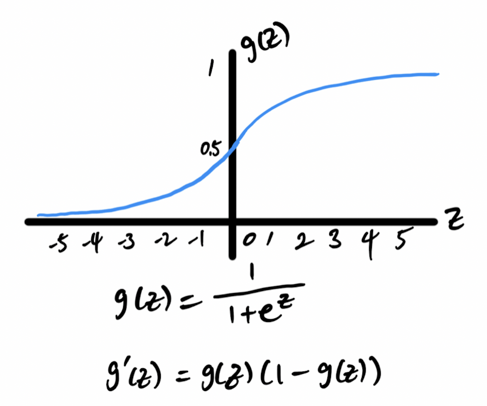
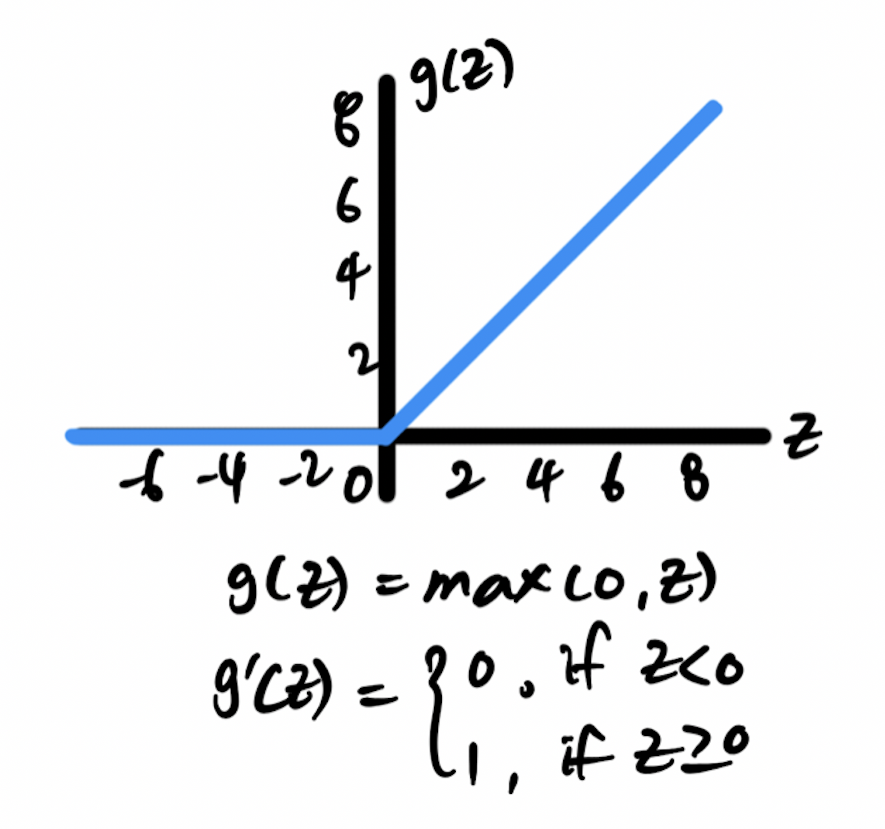
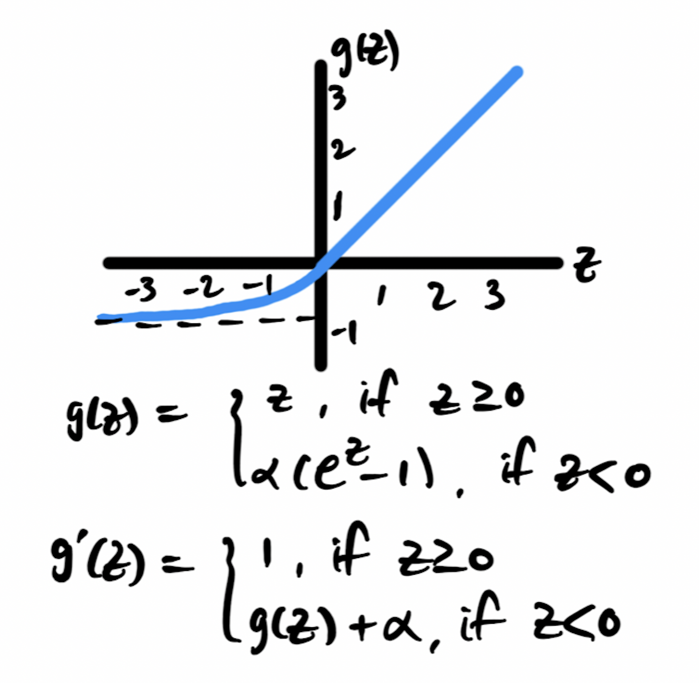
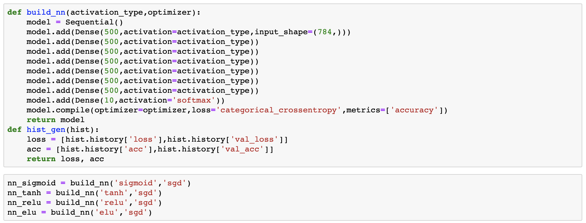
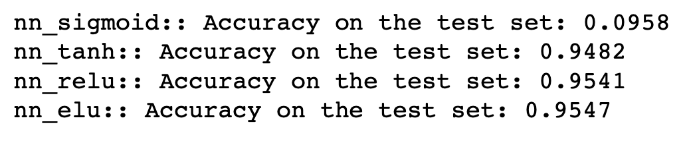

# Exploring non-linear activation functions

An activation function is an important transformer in a neural network which enables a model to learn non-linearity. Given an input or set of inputs, the output of each node in a neural network is defined by weights and an activation function. Non-linear activation functions are important in neural network hidden units; without them, the output of a neural network is simply a linear function of the input. Except for some special cases (i.e. regression), non-linear activation functions are highly desirable. 

Similar to how the human brain works, an activation function determines whether or not a neuron (each node in a neural network) should fire a signal to a next neuron. Depending on the type of an activation function, the corresponding threshold and the boundary of the activation output differ greatly.

When ***z*** is the input to the activation function, the output can be written as ***g(z)***.

Typical examples of activation functions widely used today include:

### Sigmoid (logistic) function:

- Non-linear function that is widely used in classification problems
- Good for output layer in binary classification
- Output value range in 0 and 1
- When ***z*** is very large or small, the slope becomes very small —> slow down the learning process ("gradient vanishing")

### Hyperbolic Tangent (Tanh) function:

* Non-linear function that is similar to a sigmoid function
* Output value range in -1 and 1
* Gradient is stronger than a sigmoid function
* Almost always work better than sigmoid as it centers the data around 0 mean
* When ***z*** is very large or small, the slope becomes very small —> slow down the learning process ("gradient vanishing")

### Rectified Linear Unit (ReLU) function:

- Non-linear function that helps in the sparsity of the activation (computationally efficient compared to sigmoid and tanh)
- One of the most popular choice in today's deep learning models as it can avoid a vanishing gradient problem
- Dying ReLU problem: gradient can go towards 0, and if it does, no more learning takes place in several neurons
- Since the output is 0 for all negative input, their mean activation is greater zero —> causes bias shift for a unit in next layer and thus slow down the learning process ([ref](https://arxiv.org/pdf/1511.07289.pdf))

### Exponential Linear Unit (ELU) function:

* Variation of ReLU that resolves the dying ReLU problem
* With its negative activations, their mean activation is close to zero and thus speeds up the learning process and convergence. 

## Simple experiment on the MNIST dataset

In order to compare performances of models that are constructed with different activation functions, the MNIST dataset was used. The full details of the testing code can be found ***[here][https://github.com/sungsujaing/ML_DL_articles_resources/blob/master/Code%20appendix/Activation_funtion_experiment.ipynb]***. Constructing the best model was not the main purpose in this experiment, so a simple fully-connected neural network was built with arbitrary hidden layers and units as shown below. In this case, ***stochastic gradient descent*** was chosen as an optimizer, but the code is flexible to other types as well.

With 60,000 training data and 10,000 test data, all inputs were preprocessed for normalization and flattened. The labels were one-hot-encoded as desired. 

A fraction of the training set (0.15) was used as validation and the test set was held for the later evaluation. After 20 epochs with a batch size of 256, loss and accuracy of the tested models were tracked on training and validation sets. For this particular dataset and the structure of the model built, ***elu*** and ***tanh*** seem to perform well compared to the others.

Finally, the trained models were evaluated on the test set. Again, for this particular dataset and the structure of the model built, ***elu***-based model exhibited the highest accuracy. 

To be done: perform the same comparison study on the CNN models.