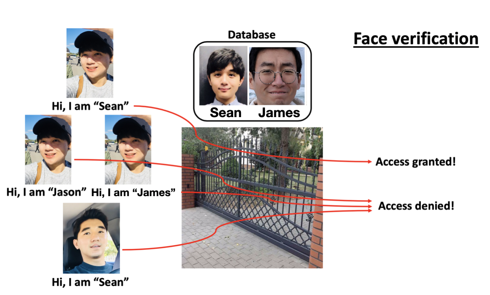

# Face recognition using OpenFace

**Face recognition** is an interesting and very powerful application of a convolution neural network (CNN). It is the ubiquitous technology that can be used for many different purposes (i.e. to claim identification at the entrance, to track the motion of specific individuals, etc.). Today's most powerful and famous face recognition networks include [FaceNet](https://arxiv.org/pdf/1503.03832.pdf) (Google) and [DeepFace](https://www.cs.toronto.edu/~ranzato/publications/taigman_cvpr14.pdf) (Facebook). This article explores the theoretical background of popular face recognition systems and also introduce the practical way of implementing FaceNet model on Keras (with TensorFlow backend) with a custom dataset.

## Face recognition and Face verification

We must not be confused *face recognition* with *face verification*. These two terms might sound similar, but they work in quite a different way. *Imagine a scenario you approach the main gate of your house where you installed an intelligent face-checking system. You previously registered a single picture of all of your family members (K individuals) in the database only to allow them in the house. In order to gain access to the house, you need to look up the camera to provide an image of your face to your face-checking system.* 

If your face-checking system is based on the ***face verification*** method:

* In addition to your face image, you also need to provide your name (or any other registered labels) to the system. The system, then, extracts your registered image from K images in the database based on the provided name, and compares it with the new image to output whether the new image is you or not. It is a **1:1 image comparison** method.

<p align="center"></p>

If your face-checking system is based on the ***face recognition*** method:

* The system compares your face image with K registered images in the database and output your name (or any other registered labels) if your face is indeed recognized to be one of the K images. It is a **1:K image comparison** method.

<p align="center"></p>

## Challenges with Face recognition systems

Compared to face verification, face recognition is more challenging as a small error in 1:1 face verification may amplify in 1:K face recognition problems. 

Unlike regular CNN networks, a face recognition model needs to learn individuals with a single image example. This concept is called ***one-shot learning*** and it is very difficult to address with conventional CNN models that require at least a few hundreds of class images that need to be classified. In addition, when the number of individuals in a database change, the CNN model itself needs to be modified  (at least its last layer with a *softmax* function) which is highly undesirable.

## One-shot learning and Similarity functions

In order to address these issues, face recognition systems implement a special function called a ***similarity function***. Instead of mapping the given images to the labels, this approach allows CNN to learn the degree of similarity (or difference) between two images. Let *d*(a,b) is a function that evaluates the difference between two images a and b. Given 𝞃 is an arbitrary constant which defines the threshold of similarities in images:

*  if *d*(a,b) <= 𝞃, then images a and b are considered to be the same
*  if *d*(a,b) > 𝞃, then images a and b are considered to be different

A typical way to learn this similarity function is to ***embed*** images into an N-dimensional vector space. Then, the similarity function can be simply defined so as to calculate the euclidian distance between the two vectors. It should be acknowledged that there are many other ways of defining a similarity function (i.e. chi-square similarity function, etc.).

<p align="center"></p>

## Learning embedding models and Triplet loss

While the concept of one-shot learning and similarity functions might look quite simple, it is very important to learn good parameters for embedding CNN models so that the last fully-connected layer with N-nodes represents the good encoding of an input image.

In other words, the embedding models need to be trained in a way to encode different pictures in a highly unique way. In today's popular face recognition models, this unique embedding problem is well addressed by implementing the concept of ***triplet loss***. Unlike the conventional CNN dataset where each image is coupled with a corresponding label, the dataset for embedding CNN with triple loss is composed of multiple triplet pairs of images. Given three images for the particular dataset instance (**'anchor'**: reference, **'positive'**: same person and **'negative'**: different person), the training is done so as to *minimize the triplet loss* or to achieve:

***d*(A,P) - *d*(A,N) + α < 0**

where α is an arbitrary margin that makes sure the model learns something other than all 0s. Or, the triplet loss function can be written as:

**Loss = max( *d*(A,P) - *d*(A,N) + α, 0 )**

meaning that, as long as *d*(A,P) - *d*(A,N) <= - α, Loss is 0. Bigger the margin constant α is, the model tries harder to learn to differentiate similiar-looking (difficult) images. 

It should be acknowledged that, even though the one-shot learning requires only a single image for inference, training this embedding CNN requires a lot of triplet image pairs and computing power, making this training process very challenging. Instead of training your own embedding CNN model, therefore, it is much easier and more efficient to utilize the open-source pre-trained models/weights. This article will explore the [Keras-OpenFace](https://github.com/iwantooxxoox/Keras-OpenFace) which is a project converting OpenFace from its original Torch implementation to a Keras version. This model is based on Google's FaceNet architecture which includes GoogLeNet inspired inception models. The models and weights are freely downloadable from their repository. ***It should be noted that this model requires a cropped frontal face as input and embeds images into a 128-d vector***. 

## Keras-OpenFace framework and basic configuration to implement a pre-trained *OpenFace*

1. On the desired path, the Keras-OpenFace github repository can be cloned.

   `git clone https://github.com/iwantooxxoox/Keras-OpenFace.git`

2. Or check out my custom implementation [**HERE**](https://github.com/sungsujaing/TV_time_tracking_face_recognition) where the models/weights are callable from the custom helper module `model_openface.py`. The following examples will be based on this option.

   `git clone https://github.com/sungsujaing/TV_time_tracking_face_recognition.git`

It should be noted that this example uses OpenCV's `face_cascade.detectMultiScale()` classifier for general face detection while the pre-trained OpenFace model/weights are used for face embedding. Before start, please create the following two folders:

* **image_database**: to store images to be registered. It is good if only one frontal face is contained in each image (not necessarily only the face because face detection will be performed anyways). File names can be set with the names of individuals.
* **test**: to store images to be tested. Each image may contain multiple images of registered/non-registered individuals.

### Import modules and model configuration

```python
import model_openface as mo ## custom helper module
import cv2
import numpy as np
import matplotlib.pyplot as plt
%matplotlib inline

model = mo.model_openface() # (1)
mo.load_weight_openface(model)

face_cascade = cv2.CascadeClassifier('haarcascade_frontalface_default.xml') # (2)
img_row = 96 # (3)
img_col = 96
box_size_factor = 10 # (4)
face_recog_thresh = 0.70 # (5)
```

(1) loading pre-trained OpenFace model/weights 

(2) loading OpenCV's face detection algorithm

(3) OpenFace CNN requires 96X96 input image dimension, therefore resizing

(4) set the threshold for the size of detectable faces in an image. Bigger `box_size_factor` value allows a smaller bounding box to be detected

(5) set the threshold (𝞃) for the similarity function

### Face detection

```python
def detect_face(img,fc=face_cascade,flag='db'):
    '''
    Receive BGR format as an input and return coordinate(s) of detected face(s)
    default: flag = 'db' --> assume only one face is present in the image and return only 1 face
    flag = 'new' --> if to embed new images (possibly multiple faces)
    '''
    img_grey = cv2.cvtColor(img, cv2.COLOR_BGR2GRAY)

    height,width = img_grey.shape
    faces_raw = fc.detectMultiScale(img_grey) # higher accuracy for faces with black glasses
    faces = []
    
    # get rid of errorneous small boxes
    for face in faces_raw:
        if face[2] > (min(height,width)/box_size_factor):
            faces.append(face)
            
    if flag == 'db':
        face_box = [0,0,0,0]
        for (x,y,w,h) in faces:
            if w > face_box[2]:
                face_box = [x,y,w,h] # IGNOTE ALL OTHER FALSY FACE BOXES for database embedding
        (x,y,w,h) = face_box
        faces = [face_box]       
    if flag == 'new':
        faces = faces
    return faces
```

### Face_embedding

```python
def embed_image(face_img,model):
    '''
    embed the RGB cropped face (input) into 128-d vector
    use with `detect_face()`
    '''
    img = cv2.resize(face_img, (img_row,img_col)).astype('float32')
    img /= 255.0
    img = np.expand_dims(img,axis=0)
    embedding = model.predict_on_batch(img)
    return embedding
```

### Database embedding

```python
def database_face_embedding():
    '''
    embed the images in the database
    output = {'name':embedding,...}
    '''
    database_embeddings = {}
    os.chdir(os.path.join(os.getcwd(),'image_database'))
    for img_file in os.listdir():
        name = img_file.split('.')[0]
        image_file = cv2.imread(img_file)
        faces = detect_face(image_file)
        (x, y, w, h) = faces[0]
        image_file = cv2.cvtColor(image_file, cv2.COLOR_BGR2RGB)
        cropped = image_file[y:y+h,x:x+w]
        database_embeddings[name] = embed_image(cropped, model)
    os.chdir(original_path)
    return database_embeddings
  
database_embeddings = database_face_embedding()
registered_name = list(database_embeddings.keys())
print('Current database contains {} images: \n{}'.format(len(database_embeddings),[key.upper() for key in registered_name]))
```

Expected processing steps and output:

<p align="center"></p>

### Face identification

```python
def identify_singe_face(new_face,database_embeddings,model,verbose=None): 
    '''
    receive one new RGB face as an input
    return name_label of that face as one of the registered members or n/a
    '''    
    new_face_embedding = embed_image(new_face,model)
    name_label = ''
    min_dist = 100
    for (registered_name,registered_embedding) in database_embeddings.items():
        euc_dist = np.linalg.norm(new_face_embedding-registered_embedding)
        if verbose:
            print('Distance from {}: {:.3f}'.format(registered_name,euc_dist))
        if euc_dist < min_dist:
            min_dist = euc_dist
            name = registered_name
    if min_dist < face_recog_thresh:
        if verbose:
            print('***this is {}!***\n'.format(name.upper()))
        name_label = name
        return name_label
    else:
        if verbose:
            print('***not registered!***\n')
        name_label='n/a'
        return name_label
```

```python
def recog_face(img,fc=face_cascade,flag='image',verbose=None):
    '''
    receive BGR image as an input
    flag = 'image' to plot image, containing n/a info
    flag = 'video' to return image and names, without containing n/a info (used as an input for `recog_face_video`)
    ''' 
    img_color = cv2.cvtColor(img, cv2.COLOR_BGR2RGB)
    faces = detect_face(img,flag='new')
    names = []
    for (x, y, w, h) in faces:
        cropped = img_color[y:y+h,x:x+w]
        if verbose:
            name = identify_singe_face(cropped,database_embeddings,model,verbose=True)
        if not verbose:
            name = identify_singe_face(cropped,database_embeddings,model)
        
        text = '{}'.format(name)
        (text_width, text_height) = cv2.getTextSize(text, cv2.FONT_HERSHEY_PLAIN,2,5)[0]
        text_offset_x = x-3
        text_offset_y = y
        box_coords = ((text_offset_x, text_offset_y+10), (text_offset_x+text_width,text_offset_y-text_height-10))
        
        if name != 'n/a':
            img_color = cv2.rectangle(img_color, (x, y), (x+w, y+h), (255,0,0), 4)
            img_color = cv2.rectangle(img_color, box_coords[0], box_coords[1], (255,0,0), cv2.FILLED)
            img_color = cv2.putText(img_color,text,(x,y),cv2.FONT_HERSHEY_PLAIN,2,(255,255,255),3)
            names.append(name)
            
        if flag == 'image':     
            if name == 'n/a':
                img_color = cv2.rectangle(img_color, (x, y), (x+w, y+h), (0,0,255), 4)
                img_color = cv2.rectangle(img_color, box_coords[0], box_coords[1], (0,0,255), cv2.FILLED)    
                img_color = cv2.putText(img_color,text,(x,y),cv2.FONT_HERSHEY_PLAIN,2,(255,255,255),3)

    if flag == 'image':      
        plt.figure(figsize=(8,8))
        plt.imshow(img_color)
        plt.axis('off')   
    if flag == 'video':
        return img_color,names
```

Expected output:

<p align="center"></p>

This idea can be simply extended to real-time modules (with video or webcam inputs). Some examples can be found in my original [repository](https://github.com/sungsujaing/TV_time_tracking_face_recognition).
