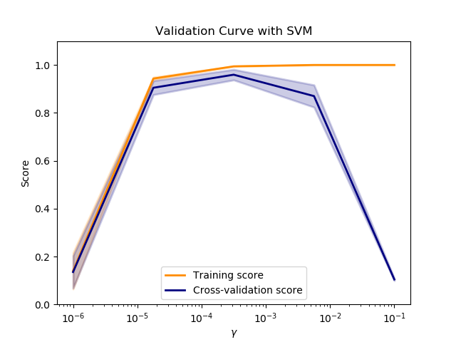
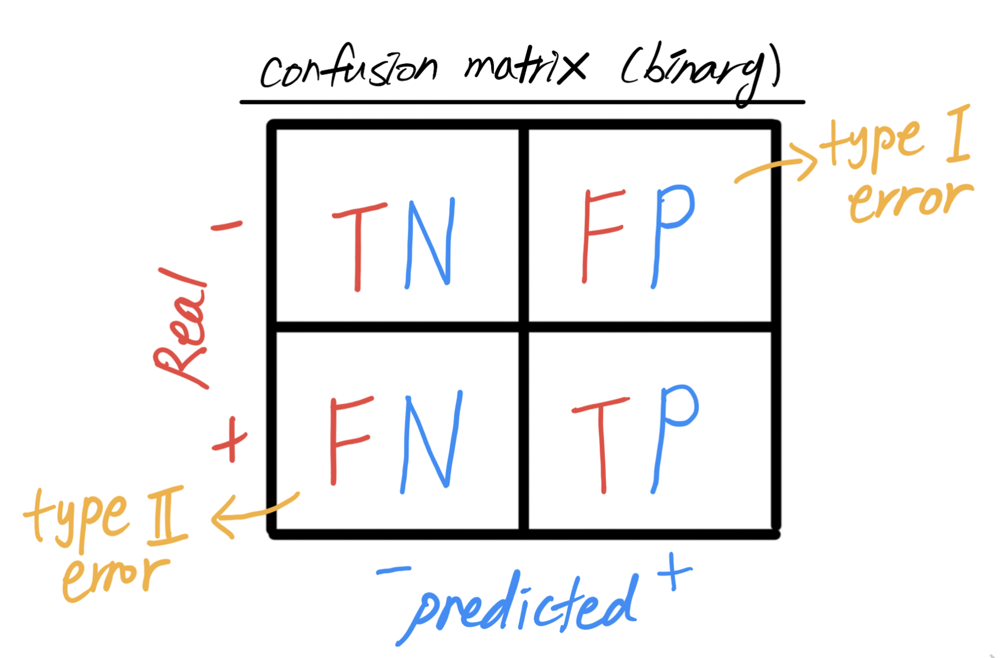

# Model evaluation and evalution metrics

During the model building process, understanding the model performance and setting an appropriate single-value evaluation metrics are critical as they can guide how to improve the model performance.

When debugging the learning algorithm, a few options to consider include:

* Obtain more training data (increase **_m_**)
* Add more features (increase **_n_**) through feature extraction
* Remove some features (decrease **_n_**) through feature selection
* Adjust hyperparameters (i.e. regularization parameters, type of kernels)

## In general: Overfitting (high variance) vs. Underfitting (high bias)

#### Rule of thumb: 

1. Model is to be fitted on the training set
2. Best model is to be selected on the cross-validation set
3. Model performance is to be evaluated on the test set

#### Tool #1: Validation curve (for hyperparameter tuning)

For a particular hyperparameter, a validation curve can help if the model is overfitting or underfitting as its value varies.

* If an error is high for both the training and the CV sets, the model is underfitting - High bias
* If an error is high for the CV set, but low for the training set, the model is overfitting - High variance

#### Tool #2: Learning curve

A learning curve can help if the model is overfitting or underfitting as the number of training sample varies.

- If errors of the training and the CV sets converge to a high value, the model is underfitting - High bias (Fig. a)
- If an error of the CV set is way higher than that of the training set, the model is overfitting - High variance (Fig. b)

#### Some options to consider for improvement

|                  | Consider                                                     |
| ---------------- | ------------------------------------------------------------ |
| **Overfitting**  | <ul><li>Increasing **_m_**</li><li>Decreasing **_n_** by removing some less important features</li><li>More regularization</li></ul> |
| **Underfitting** | <ul><li>Note: increasing **_m_** does not help improving the model performance</li><li>Increasing **_n_** by adding more features</li><li>Less regularization</li></ul> |

1. If a model is overfitting (high variance), consider:
   * Increasing **_m_**
   * Decreasing **_n_** by removing some less important features
   * More regularization
2. If a model is underfitting (high bias), consider:
   * Note: increasing **_m_** does not help to improve the model performance
   * Increasing **_n_** by adding more features
   * Less regularization

## For a classification model (binary)

The model performance is usually evaluated by various evaluation methods (i.e. accuracy, user satisfaction, survival rate of the patient, etc.). **_Accuracy_** is the most popular default choice, but it may give a _partial_ picture of performance only in many scenarios.

* Typical example: imbalanced or skewed class (only a small subset of data explains positive class)
  * Possible scenarios: occurrence of fire in a city, occurrence of malignant tumors, credit fraud detection, etc.
  * Problem: Even an untrained model (dummy classifier) may give higher accuracy by predicting all as negative 
* Solution: consider other evaluation metrics such as precision and recall (confusion matrix)
  * **_<u>P</u>_**recision = % True among **_<u>P</u>_**redicted as True (important when to avoid False **_<u>P</u>_**ositive)
  * **_<u>R</u>_**ecall = % True among **_<u>R</u>_**eal True (important when to avoid False Negative)

* Precision and Recall trade-off

  | When?                   | Action                           | Precision | Recall   |
  | ----------------------- | -------------------------------- | --------- | -------- |
  | To avoid False Positive | Raise decision threshold (> 0.5) | Increase  | Decrease |
  | To avoid False Negative | Lower decision threshold (< 0.5) | Decrease  | Increase |

* Two metrics can be difficult to compare when choosing the better model, consider:
  * F1  = 2(Precision*Recall) / (Precision + Recall)
  * F&beta;  = (1+&beta;2)(Precision*Recall) / (&beta;2Precision + Recall) 
    * &beta; is set high when recall is important (i.e. ~2)
    * &beta; is set low when precision is important (i.e. ~0.5)
  * Receiver operating characteristic (ROC) curve and its area underneath the curve (AUC)

## For a classification model (multi-clasee)

As an extension of a simple binary case, overall evaluation metrics are averaged across classes. They are different ways of averaging them and, depending on the distribution of classes, they may lead to different results.

* Type of averaging
  * **Macro**-average: each **class** has equal weight. Compute metrics within each class, then average them.
  * **Micro**-average: each **instance** has equal weight. Aggregate the outcome first, then compute metrics. In this case, large classes have more influence.

| When?                                   | Averaging to do |
| --------------------------------------- | --------------- |
| To weight more toward the small classes | Macro           |
| To weight more toward the large classes | Micro           |

* Compare two averaging results:
  * if micro- << macro-, large classes have poor metrics
  * if micro >> macro-, small classes have poor metrics

## For a regression model

Typically, r2 score (total variance explained by a model/total variance) is satisfactory. If not, consider to minimize:

* Mean Absolute Error (MAE)
  * average magnitude of the differences (errors) between the predicted and true target values
  * MAE holds the same unit as the target variable and easy to interpret 
  * do not distinguish between over- and under-estimations
* Mean Squared Error (MSE)
  * similar to MAE, but apply more penalty to high-errored values (desirable when large errors should be avoided)
  * MSE holds a different unit from the target variable
  * do not distinguish between over- and under-estimations
* Root Mean Squared Error (RMSE)
  * similar to MSE, more penalty to high-errored values  (desirable when large errors should be avoided)
  * similar to MAE, RMSE holds the same unit as the target variable, but more challenging to interpret the result
  * do not distinguish between over- and under-estimations
* Median Absolute Error
  * robust to outlier
* etc.

