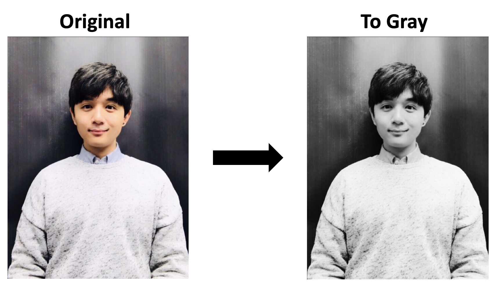
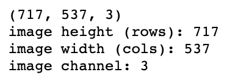
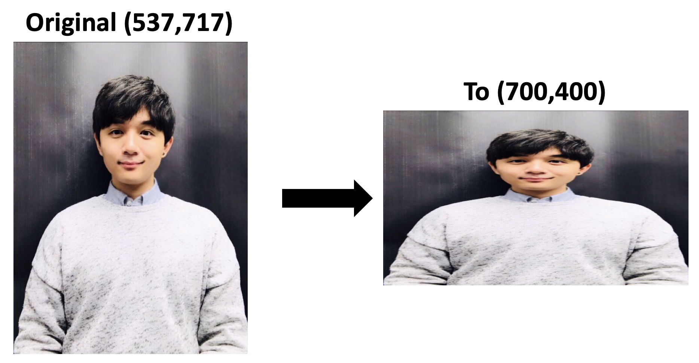
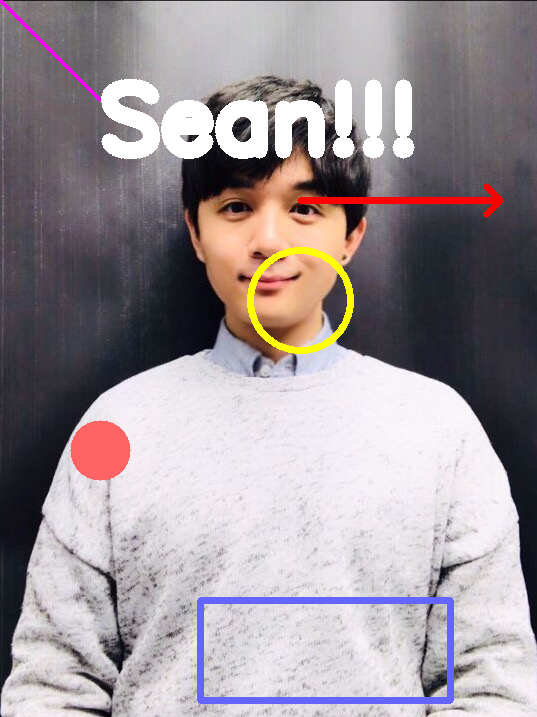
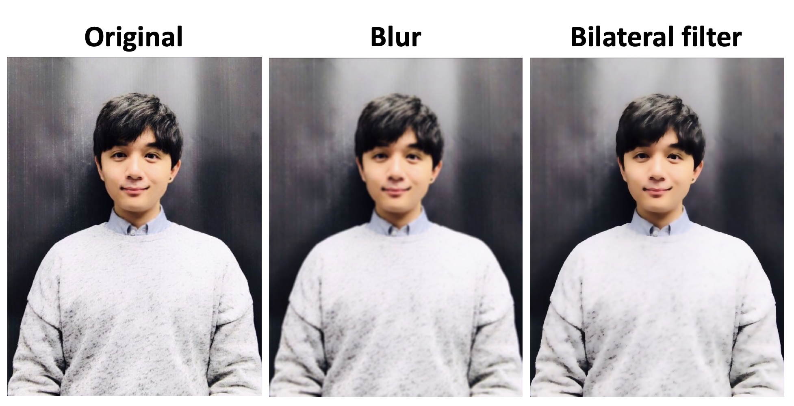
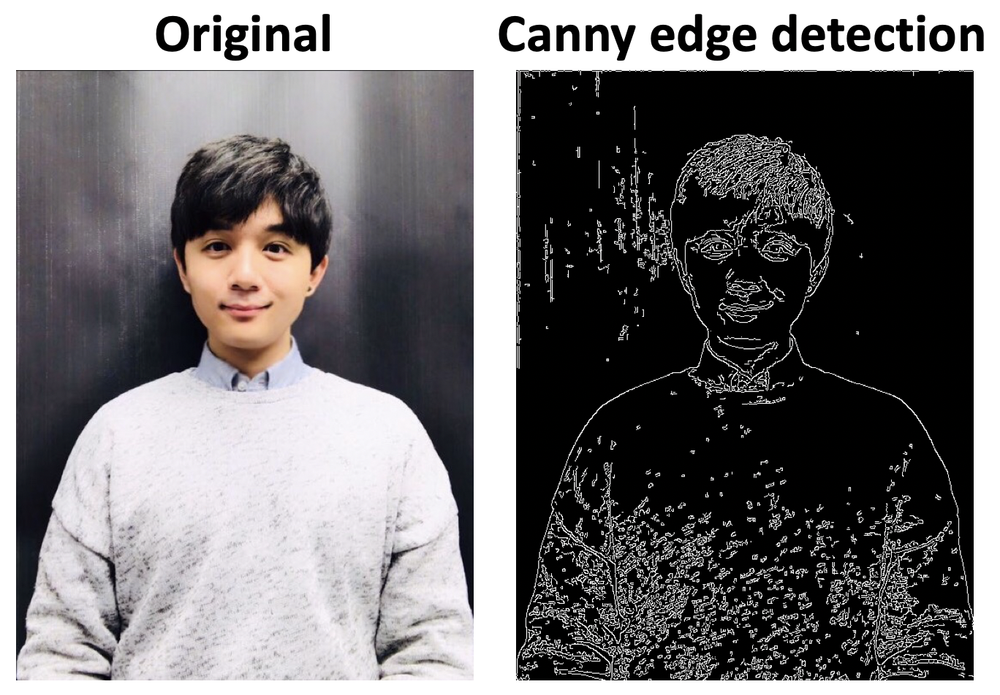

# OpenCV basics in Python (Jupyter notebook)

**OpenCV** (Open source Computer Vision) is an open-source software library that supports various applications in the field of real-time computer vision. Initially released about two decades ago by Intel, it has become one of the most popular and powerful libraries required in many deep learning projects. It was originally written in C++, but this article would like to focus on the basic/fundamental uses of this library in Python, especially in the Jupyter notebook environment. The purpose of this article is to provide the practical examples of the usages of some basic OpenCV algorithms on ***images and videos*** so that one can build upon the projects more easily. 

* Codes (full version): [HERE](https://github.com/sungsujaing/ML_DL_articles_resources/blob/master/Code%20appendix/OpenCV_tutorial.ipynb)
* OpenCV official document: [HERE](https://docs.opencv.org/3.0-beta/index.html)

## Install and import OpenCV

Some basic installation commends include, but not limited to:

* `pip install opencv-python`
* `conda install -c conda-forge opencv`

Please note that Numpy library will also be installed along with OpenCV if not previously installed in the system. As Numpy is a highly optimized library for numerical operations, all the OpenCV structures are fully based on Numpy arrays. After installation, you can import and check the version of installed libraries.

```python
import cv2 # import OpenCV
import numpy as np # import Numpy
print(cv2.__version__)
print(np.__version__)
import os # to handle the path variables
```

## Handling *images*

In this section, various functions will be explored to handle images. My profile picture ('opencv_SeanProfile.jpg') will be mainly used as an example, but any other images can be handled in the very same ways.

### Loading, processing and writing

```python
# Loading
image_path = os.path.join('..','images','opencv_SeanProfile.jpg') # (1)
img = cv2.imread(image_path,1) # (2)
cv2.imshow('image',img) # (3)
cv2.waitKey(0) # (4)
cv2.destroyAllWindows() # (5)
cv2.waitKey(1) # (6)
# Processing
img = cv2.cvtColor(img,cv2.COLOR_BGR2GRAY) # (7)
# Writing
cv2.imwrite(os.path.join('..','images','opencv_SeanProfile_gray.png'),img) # (8)
```

(1) setting the image path for 'opencv_SeanProfile.jpg'

(2) Load the image. The numeric flag specifies the color type of the loaded image. (0: grayscale, -1: image as it is (with alpha channel), 1: 3-channel (*BLUE, GREEN, RED*) color scale)

(3) Display the image. Image window named 'image' appears and disappears automatically unless set the waitKey() below.

(4) Display the image indefinitely until the keyboard input (any key). If not 0, the window appears for the corresponding milliseconds then disappear.

(5) Destroy all opened windows

(6) It is a trick to close the opened window in the Jupyter notebook environment. This step is only required when `cv2.imshow()` is forced to be used in a client/server environment like Jupyter notebook. Since the `cv2.imshow()` image box and the notebook share the same kernel, there occurs the conflict in who gets the control of the kernel, and the kernel crashes if you try to force quit the image window. While this trick closes the image window even in the Jupyter notebook, it should be noted that it does not completely terminate the window. Another workaround is to use `plt.imshow()` of Matplotlib to display images processed by OpenCV functions in an RGB color space, but this tutorial will stick with the generic `cv2.imshow()`.

(7) Convert the color image to gray. One example of many image processing algorithms. 

(8) Saving the processed image

<p align="center"></p>


### Obtaining properties of the image

```python
img = cv2.imread(image_path,1)
rows,cols,channel = img.shape # (1)
print(img.shape) # height (rows), width (cols), channel
print('image height (rows): {}\nimage width (cols): {}\nimage channel: {}'.format(rows,cols,channel))
```

(1) `.shape` gives you the dimensional properties of the image. Just like any regular Numpy array, it is in the form of **rows (height), columns (width), channel**. It should be noted that it is different from the **(width, height, channel)** standards.

<p align="center"></p>

### Resizing

```python
img = cv2.imread(image_path,1)
img = cv2.resize(img,(700,400)) # (1)
print(img.shape)
cv2.imshow('image',img) 
cv2.waitKey(0)
cv2.destroyAllWindows()
cv2.waitKey(1)
```

(1) `.resize()` is used to resize the image. It should be noted that the desired dimension needs to be provided in the **(width, height)** or (cols, rows) format.

<p align="center"></p>


### Insert geometric shapes

The detailed arguments required in the drawing functions can be found [HERE](https://docs.opencv.org/3.0-beta/modules/imgproc/doc/drawing_functions.html). It should be noted that the position arguments need to be provided in the **(width, height)** or (cols, rows) format. The color arguments are in a BGR format.

```python
img = cv2.imread(image_path,1)
cv2.line(img,(0,0),(100,100),(255,0,255),2) # pink diagnal line
cv2.circle(img,(300,300),50,(0,255,255),5) # yellow circle (hollow)
cv2.circle(img,(100,450),30,(100,100,255),-1) # light red circle (filled)
cv2.rectangle(img,(200,600),(450,700),(255,100,100),5) # blueish rectengle
cv2.arrowedLine(img,(300,200),(500,200),(0,0,255),6) # red arrow
cv2.putText(img,"Sean!!!", (100,150), cv2.FONT_HERSHEY_SIMPLEX,3,(255,255,255),cv2.LINE_AA) # white text
cv2.imshow('image',img) 
cv2.waitKey(0)
cv2.destroyAllWindows()
cv2.waitKey(1)
```

<p align="center"></p>

### Find pixel coordinate in the image

As shown above, in order to insert shapes or texts on the image, the pixel coordinates need to be specified.  The following custom code allows us to obtain the pixel coordinates easily so as to provide them in other functions. It utilizes a mouse's `on_click` event to explore the image.

```python
def on_click(c_event,x,y,flags,param):
    if c_event == cv2.EVENT_LBUTTONDOWN:
        text = '({},{})'.format(x,y)
        cv2.circle(img,(x,y),5,(0,0,255),-1)
        cv2.line(img,(x,0),(x,rows),(0,0,255),1,4)
        cv2.line(img,(0,y),(cols,y),(0,0,255),1,4)
        cv2.putText(img,text,(x+10,y),cv2.FONT_HERSHEY_PLAIN,1.5,(0,0,255),2,cv2.LINE_AA)
        cv2.imshow('image',img)
        
img = cv2.imread(image_path,1)
cv2.namedWindow('image')
clean_img = img.copy()
cv2.setMouseCallback('image',on_click)

while True:
    cv2.imshow('image',img)  
    key = cv2.waitKey(1) & 0xFF # (1)   
    if key == ord('r'): # (2)
        img = clean_img.copy()
    if key == ord('q'): # (3)
        break
cv2.destroyAllWindows()
cv2.waitKey(1)
```

(1) 0xFF mask is to make sure the keyboard inputs are read properly even when the NumLock is activated. For more details, please refer to [Here](https://stackoverflow.com/questions/35372700/whats-0xff-for-in-cv2-waitkey1). 

(2) Press 'r' to reset the window

(3) Press 'q' to close the window

<p align="center"></p>

### Simple processing - blurring to remove noise

Other blurring types include: 

* Gaussian blurring
* Median blurring (good to handle salt-and-pepper noise)

For all available blurring algorithms and required arguments, please refer to the [OpenCV document](https://docs.opencv.org/3.1.0/d4/d13/tutorial_py_filtering.html).

```python
img = cv2.imread(image_path,1)
img_blur = cv2.blur(img,(5,5)) # (1)
img_bf = cv2.bilateralFilter(img,9, 75, 75) # (2)
cv2.imshow('image',img) 
cv2.waitKey(0)
cv2.imshow('image_blur',img_blur) 
cv2.waitKey(0)
cv2.imshow('image_bf',img_bf) 
cv2.waitKey(0)
cv2.destroyAllWindows()
cv2.waitKey(1)
```

(1) Blurring by averaging

(2) Blurring while preserving the edge

<p align="center"></p>


### Simple processing - canny edge detection

Other edge detection types include:

* Sobel edge detection
* Laplacian edge detection

For the full details about the required arguments, please refer to the [OpenCV document](https://docs.opencv.org/3.1.0/da/d22/tutorial_py_canny.html).

```python
img = cv2.imread(image_path,1)
img_canny = cv2.Canny(img,50,100) # (1)
cv2.imshow('image',img) 
cv2.waitKey(0)
cv2.imshow('image_canny',img_canny) 
cv2.waitKey(0)
cv2.destroyAllWindows()
cv2.waitKey(1)
```

(1) Canny edge detection

<p align="center"></p>


### Simple processing - threshold filtering

For the threshold filtering, the source image should be in grayscale. Other threshold filtering types include:

- Binary inversed (global): `cv2.THRESH_BINARY_INV`
- To-zero inversed (global): `cv2.THRESH_TOZERO_INV`
- Adaptive with Gaussian weighted threshold (adaptive): `cv2.ADAPTIVE_THRESH_GAUSSIAN_C`

For all available threshold filtering algorithms and required arguments, please refer to the [OpenCV document](https://docs.opencv.org/3.4.0/d7/d4d/tutorial_py_thresholding.html).

```python
img = cv2.imread(image_path,0)
ret,th_binary = cv2.threshold(img,100,255,cv2.THRESH_BINARY) # (1)
ret,th_trunc = cv2.threshold(img,100,255,cv2.THRESH_TRUNC) # (2)
ret,th_tozero = cv2.threshold(img,100,255,cv2.THRESH_TOZERO) # (3)

th_adap_mean = cv2.adaptiveThreshold(img,255,cv2.ADAPTIVE_THRESH_MEAN_C,cv2.THRESH_BINARY,11,2) # (4)

cv2.imshow('image_binary',th_binary) 
cv2.waitKey(0)
cv2.imshow('image_trunc',th_trunc) 
cv2.waitKey(0)
cv2.imshow('image_tozero',th_tozero) 
cv2.waitKey(0)
cv2.imshow('image_adap',th_adap_mean) 
cv2.waitKey(0)
cv2.destroyAllWindows()
cv2.waitKey(1)
```

(1) binary: 0 for below th and 1 for above th

(2) trunc: keep the same value up to th and set th for all the higher values (similar to low-pass filter)

(3) tozero: 0 for below th and keep the same value for above th

(4) adaptive filtering calculates th for small regions of the image; ***better result for an image with varying illuminations***. th value is the mean of the neighbourhood area.

<p align="center"></p>


### Optimizing the parameters

Many OpenCV functions require the parameters to be optimized for the best image processing results. The following code shows an example of parameter tunning where two Trackbars are used to explore the optimal parameters of the Canny edge detection algorithm for the given image.

```python
img = cv2.imread(image_path,1)
cv2.namedWindow('image_canny')

cv2.createTrackbar('th1','image_canny',100,255,lambda x: None)
cv2.createTrackbar('th2','image_canny',200,255,lambda x: None)

while True:
    cv2.imshow('image_canny',img_canny)
    if cv2.waitKey(1) & 0xFF == ord('q'):
        break
        
    th1 = cv2.getTrackbarPos('th1','image_canny')
    th2 = cv2.getTrackbarPos('th2','image_canny')
    img_canny = cv2.Canny(img,th1,th2)
cv2.destroyAllWindows()
cv2.waitKey(1)
print('chosen th1: {}\nchosen th2: {}'.format(th1,th2))
```

<p align="center"></p>


## Upcoming tutorials include:

* video analysis
* real-time webcam input analysis
