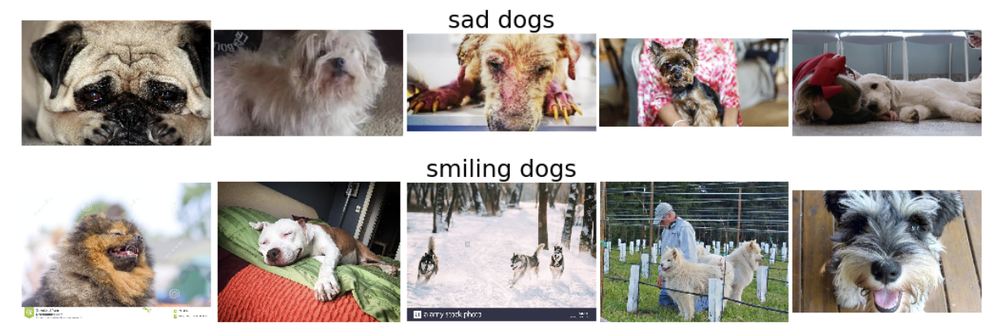

# Preparing your own image dataset:

### *Download and pre-process the image directories*

Prior to building an image classifier for different purposes, one of the most critical tasks to perform is to collect a set of quality images for training. While many image databases provide various types of image for practitioners to download and use, preparing one's own can be challenging and time-consuming.

If only a few, one can do it manually with not many difficulties. However, considering the nature of typical DNN models where a greater amount of data tends to help to achieve a better model, one needs to collect more than just a few images in his/her training set.

Among a few options, this article introduces the uses of the **google_images_download** module in *Python*. Detailed module information can be found [here](https://github.com/hardikvasa/google-images-download).

This module performs:

* Download multiple images from google based on the provided search queries
* Type of images to download can be specified based on extension, dimension, size, etc.
* Auto-categorize images of different search query into different folders 

In this article, practical uses of this module, including the effects of its important parameters, will be explored.

### Installation

simply run `pip install google_images_download` on your python environment.

### Define a module object and helper function

``` python
from google_images_downlaod import google_images_download
gld = google_images_download.googleimagesdownload()

def download_img(query):
  params = ... # (1)
  try:
    gld.download(params)
  except FileNotFoundError: # (2)
    params = ...
    try:
      gld.download(params)
    except:
      pass
```

**(1)** params: define download arguments in a form of dictionary

A full list of argument can be found [here](https://google-images-download.readthedocs.io/en/latest/arguments.html). A few important arguments include:

* `keywords`: search keywords; = query
* `limit`: number of images to download
* `format`: format of image files to download
* `chromedriver`: path to chromdriver; important if to set `limit` > 100; more details found [here](#chromedriver)
* `silent_mode`: suppress any messages; useful when organizing

The directory structure looks like <`output_directory`><`image_directory`>< `images`>. If not specified, default is `output_directory` = downloads and `image_directory` = name of the keywords

**(2)** not mandatory, but handles a FileNotFoundError

### Define a search query and download

``` python
search_queries = ['smiling dogs','sad dogs'] # keyword examples
download_msg = []
for query in search_queries:
  download_img(query)
  msg = 'Downloaded {} {} images!'.format(len(os.listdir(custom_path)),query)
  download_msg.append(msg)  
for msg in download_msg:
  print(msg)
```

#### *Output example*

<p align="center"></p>

In this case, `limit` was set to 1000. However, not all 1000 images could be downloaded because they were not downloadable. 

A few possible way around include:

* set `limit` argument to a much greater value
* add `related_images` argument to download other images related to the keyword provided

### Chromedriver

By default, Google displays 100 images per page. By moving to the next page or scrolling down, more images can be loaded on the web, but `google_images_download` module requires a chromedriver to do that automatically. 

chromedriver can be downloaded [here](http://chromedriver.chromium.org/downloads). A correct driver needs to be downloaded based on the chrome browser version. The path to 'chromedriver.exe' then simply needs to be provided as one of the arguments as described above.

### (Optional) image directory pre-processing: file renaming

The downloaded image files are numbered but still contain arbitrary file names. If required, the files can be renamed so as to be listed like:

* smilingdog_01.jpg
* smilingdog_02.jpg
* ...

``` python
import os
original_path = os.getcwd()
data_path = os.path.join(original_path,'downloads') # (1)
data_folders = os.listdir(data_path)

for folder in data_folders: # (2)
    working_dir = os.path.join(data_path,folder)
    os.chdir(working_dir)
    current_list = os.listdir(os.getcwd())
    for i in range(len(current_list)):
        original_name = current_list[i]
        new_name = "".join(folder.split()) + '_{:02d}'.format(i+1) + os.path.splitext(original_name)[-1] # (3)
os.chdir(original_path)
```

**(1)** if `output_directory` was not defined above; if defined, replace 'downloads' with a proper name

**(2)** loops over each image folder for renaming

**(3)** defines the new name format of files  

### (Optional) Display the downloaded images

``` python
import cv2
import numpy as np
import matplotlib.pyplot as plt
%matplotlib inline # if run on jupyter notebook

np.random.seed(seed=0)
n_samples = 5 # number of sample to display from each category
n_categories = 2
fig, row = plt.subplots(n_categories, n_samples, figsize = (4*n_samples, 3*n_categories))

for col,folder in zip(row,data_folders):
    col[int(np.floor(n_samples/2))].set_title(folder,fontsize=25)
    working_dir = os.path.join(data_path,folder)
    os.chdir(working_dir)
    for col_ax,img in zip(col,np.random.choice(os.listdir(os.getcwd()),n_samples,replace=False)):
        rand_img = cv2.imread(img)
        rand_img = cv2.cvtColor(rand_img,cv2.COLOR_BGR2RGB)
        col_ax.imshow(rand_img)
        col_ax.axis('off')
plt.subplots_adjust(left=0.2, wspace=0.02)
os.chdir(original_path)
```

#### *Output example*
<p align="center"></p>

### Next !?

The prepared dataset can then be fed into a CNN model for training. 

