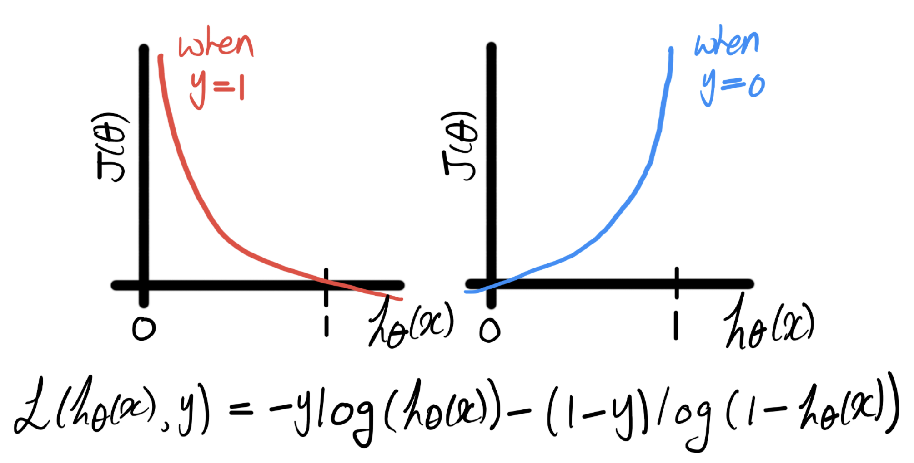

# Comparative studies of Classic supervised machine learning algorithms

> Learn from experience (E) with respect to some task (T) and some performance measure (P), if its performance (T), as measured by (P), improves with experience (E) - Tom Mitchell (1998)

In many cases, different Machine Learning (ML) algorithms may exhibit similar performances. What is more important include:

* nature of data (type, correlation, etc.)
* amount of data
* hyperparameter tunning
* evaluation metrics
* etc.

#### For the list below:
**_m_** refers to # of training data\
**_n_** refers to # of feature

## Linear models
#### Linear regression
* Common parametric algorithm for regression tasks
* Model: h&theta;(x) = &theta;Tx where &theta; and x are n+1 dimensional vectors
* Typical cost function: MSE
* In case of linear regression, a simple normal equation (&theta; = (XTX)-1XTy) can be solved instead of applying the gradient descent optimizer. However, this numerical approach tends to be slower when **_n_** gets large.
#### Logistic regression
* Common parametric algorithm for classification tasks
* Usually **sigmoid function** (g) is applied to a linear regression model to build a logistic regression classifier
* Model: h&theta;(x) = g(&theta;Tx) where g(z) = (1+e-z)-1
* Typical cost function: entropy
* Falling in 0 - 1, logistic regression predict probability y falling in a certain class given x, parameterized by &theta;
* Threshold (default: 0.5) can be arbitrarily adjusted based on the specific evaluation criteria

#### For both cases
* No hyperparameter that controls model complexity 
* Important hyperparameters include
  * Regularization parameter (&lambda;) - should followed by feature scaling
  * Learning rate (&alpha;)

| Pros | Cons |
| ------ | ------ |
| <ul><li>Fast training and easy to understand/explain the results</li><li>Provide feature significance</li><li>**Convex cost function**</li><li>Work well when **_m_** is small and **_n_** is large</li></ul> | <ul><li>Naturally **_not_** flexible to model non-linear hyperplanes</li><li>Cannot handle categotical variables well</li><li>Adding high-order features is an option, but is difficult and time-consuimng</li><li>Feature scaling becomes important when adding high-order features</li><li>Susceptible to outliers and co-linearity</li></ul> |

## Support Vector Machines (SVM)
* Common parametric algorithm for both regression and classification tasks
* Only uses the subset of training data (support vectors) to model decision functions
* Predict 1 if &theta;Tx >= 1. Predict 0 if &theta;Tx <= -1, forcing to have an extra margin
* Its cost function is the simpler version of that of logistic regression
* For a classification task, it is a hard classifier which provides no probability
* Using kernel tricks, feature space is expanded to higher orders without adding any new features. A linear classifier fitted in the transformed space becomes non-linear classifier in the original space.
* Important hyperparameters include
  * Regularization parameter (C)
  * Type of kernel
  * Kernel-related parameters such as kernel width (&Gamma;) in case of using RBF kernel, and degree of a polynomial in case of using polynomial kernel.

| Pros | Cons |
| ------ | ------ |
| <ul><li>Support non-linear problems well using kernels</li><li>Robust to overfitting and outliers compared to the linear models</li><li>Convex cost function</li><li>Work well when **_m_** is small and **_n_** is large (even infinite!)(</li><li>Memory efficient</li></ul> | <ul><li>Difficult to interpret the restuls</li><li>When using kernels, possibly be difficult to tune hyperparameters</li><li>With **_m_** going large, training speed and memory efficiency goes down greatly</li><li>Feature scaling becomes criticial when employing kernels</li></ul> |

## K-nearest Neighbors (KNN)
* Non-parametric algorithm for both regression and classification tasks
* Memory-based learning which involves the entire dataset during the prediction
* Important hyperparameters to tune include:
  * Number of nearest neighbors the classifier will retrieve (K); usually odd number
  * Distance metric (i.e. Euclidian)
  * Optimal weighting function (i.e. closer neighabor gets more weight?)
  * Method of aggregating (i.e. majority vote)

| Pros | Cons |
| ------ | ------ |
| <ul><li>Very simple and easy to understand/explain the results</li><li>Few assumptions on data</li><li>Support non-linear problems</li><li>May outperform other complex algorithm when **_m_** is large and **_n_** is small</li></ul> | <ul><li>**_K_** should be wisely selected</li><li>High computational cost in training and prediction when **_m_** is large</li><li>Not good when **_n_** is large (i.e. sparse)</li><li>Hard to deal with categorical features</li><li>Feature scaling is important</li></ul> |

## Decision Tree

* Non-parametric algorithm for both regression and classification tasks.
* Use of the "if-then-else" decision rules
* Important hyperparameters to tune include:
  - Maximum depth: the maximum depth of the tree
  - Minimum sample split: the minimum number of samples needed for split

| Pros | Cons |
| ------ | ------ |
| <ul><li>Easy to explain the rationale (white-box)</li><li>Easily learn non-linear solution</li><li>Fairly robust to co-linearity problems</li><li>No feature pre-processing is required</li><li>Deals with categorical data very well</li><li>Provides feature importance information</li></ul> | <ul><li>May lose important information while dealing with continuous variable</li><li>Overfit quite easily</li><li>High variance (different splits can lead to very different results)</li><li>Can be susceptible to outliers</li></ul> |

## Ensemble Tree
* Combine the predictions of multiple base models
* Bagging (i.e. Random Forest) or Boosting (i.e. AdaBoost, Gradient Boosting)
* Non-parametric algorithm for both regression and classification tasks
* More robust and accurate compared to the single tree model
* Important hyperparameters to tune include:
  - Number of individual estimators
  - Maximum depth: the maximum depth of the tree
  - Minimum sample split: the minimum number of samples needed for split

| Pros | Cons |
| ------ | ------ |
| <ul><li>Easily learn non-linear solution</li><li>Fairly robust to outliers and co-linearity problems</li><li>No feature pre-processing is required</li><li>Handles overfitting issue very efficiently</li><li>Deals with categorical data very well</li><li>Provide feature importance information</li><li>Easily parallelized across multiple processors</li></ul> | <ul><li>May lose important information while dealing with continuous variable</li><li>Computationally expensive as the number of trees gets larger</li><li>Difficult to explain the results</li></ul>|

## Naive Bayes
* Parametric and generative probability algorithm for classification tasks
* Simple algorithm that depends on Bayes rule
* Assume mutual independence among features (Naive)

| Pros | Cons |
| ------ | ------ |
| <ul><li>Performs very well compared to its simplicity</li><li>Very simple and fast to train</li><li>Works well when **_m_** is small</li><li>Handles irrelevant features well</li></ul> | <ul><li>Highly susceptible to co-linearity</li><li>Easily outperformed by other properly-tuned complex models</li></ul> |

## Neural network (deep)
* Non-parametric algorithm for both regression and classification tasks
* Complex algorithm that tries to mimic the human brain
* Important hyperparameters to tune include:
  - Number of hidden layers
  - Activation function (i.e. ReLU, Sigmoid)
  - Batch size

| Pros | Cons |
| ------ | ------ |
| <ul><li>Can learn very complex functions</li><li>No need for arbitrary feature engineering</li><li>Robust to outliers</li></ul> | <ul><li>Require large amount of data to be trained properly</li><li>Computationally expensive</li><li>Many hyperparameteres to tune</li><li>Difficult to interpret the results (black-box)</li></ul> |