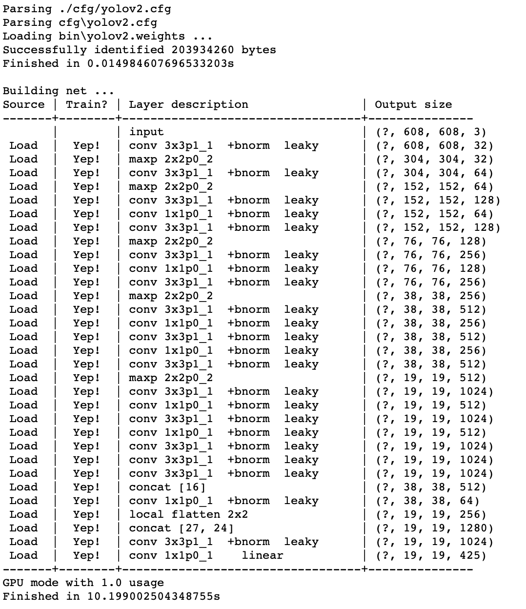
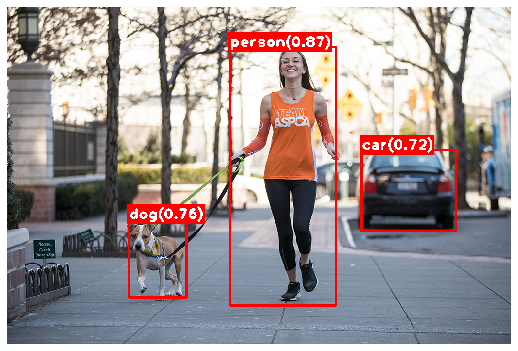

# Training and running Yolo on Jupyter notebook (TensorFlow)

**YOLO (You Only Look Once)** is one of the fastest and most popular *one-stage object detector* currently in the field. Unlike other typical two-stage object detectors like R-CNN, YOLO looks at the entire image once (with a single neural network) to localize/classify the objects that it was trained for. The most up-to-date version (YOLO version 3) is shown to be highly competitive to other object detectors in terms of mAP, but about > 4 times faster. The detailed comparison can be found on their official [website](https://pjreddie.com/darknet/yolo/).

The original YOLO algorithm is implemented in [Darknet framework](https://github.com/pjreddie/darknet) by Joseph Redmon. This open-source framework is written in C and CUDA, and its detailed implementation can be found on the [Darknet project website](https://pjreddie.com/darknet/). The pre-trained models and weights are fully available and these can be used to detect in real-time the objects that the model has been trained for.

Along with the original darknet, we also have a new framework called [**darkflow**](https://github.com/thtrieu/darkflow). Thanks to thtrieu, the darknet framework has been translated into TensorFlow under the name of darkflow. With darkflow, YOLO (only support up to YOLO version2 yet!) can be retrained/customized on TensorFlow.

The detailed implementation of YOLO on darkflow is described in its repository where it utilizes the ***flow*** method on a console. This article describes the step-by-step process of running/training YOLO on Jupyter notebook.

## Before start

It would be a good idea to create a new virtual working environment for YOLO as it may require some modules on their previous versions. 

Recommended modules/versions include:

* TensorFlow 1.12.0
* CUDA 9.0 (for GPU implementation)
* opencv 3.4.1 or 3.4.5
* Cython 0.29.10

#### If not installed yet:

* VisualStudio 2015 and essential build tools ([Microsoft Build Tools 2015 Update 3](https://visualstudio.microsoft.com/vs/older-downloads/)): This is essential in building Cython extensions in place (C-based darknet —> python-based darkflow).

## Darkflow framework and basic configuration to *implement a pretrained YOLO*

1. On the desired path, the darkflow github repository can be cloned.

   `git clone https://github.com/thtrieu/darkflow`

2. Build the Cython extensions in place.

   `python setup.py build_ext —inplace` or `pip install -e` or `pip install .`

3. Create a folder:

   * ../darkflow/bin - to store weights

4. Download the YOLO model and the corresponding weights from [HERE](https://pjreddie.com/darknet/yolo/) (please note that darkflow does not support YOLO version 3 yet).

5. save the model to ../darkflow/cfg and the weight to ..darkflow/bin.

6. Make sure the *labels.txt* file contains the correct class names/numbers for the model being used ([example](https://github.com/thtrieu/darkflow/blob/master/cfg/coco.names)).

### Import modules and model configuration

```python
from darkflow.net.build import TFNet
import tensorflow as tf
import cv2
import os
import matplotlib.pyplot as plt
%matplotlib inline
import numpy as np

config = tf.ConfigProto(log_device_placement=True)
config.gpu_options.allow_growth=True
with tf.Session(config=config) as sess:
    options = {
        'model':os.path.join('cfg','yolov2.cfg'), #(1)
        'load':os.path.join('bin','yolov2.weights.weights'), #(1)
        'threshold':0.5, #(2)
        'gpu':1.0 #(3)
    }
    tfnet = TFNet(options)
```

(1) custom names for a model and the corresponding pretrained weights

(2) the threshold value (0.0-1.0) for non-maximum suppression

(3) the portion of the gpu memory to use

Expected output:

<p align="center"></p>


### Run the pre-trained YOLO on a sample image

```python
img = cv2.imread(os.path.join('test_images','test_image_general.jpg'))
img = cv2.cvtColor(img,cv2.COLOR_BGR2RGB)
result = tfnet.return_predict(img)
for r in result:
    tl = (r['topleft']['x'], r['topleft']['y'])
    br = (r['bottomright']['x'], r['bottomright']['y'])
    label = r['label']
    conf = r['confidence']
    text = '{}({:.2f})'.format(label,conf)
    (text_width, text_height) = cv2.getTextSize(text, cv2.FONT_HERSHEY_PLAIN,2,5)[0]
    text_offset_x = tl[0]-3
    text_offset_y = tl[1]
    box_coords = ((text_offset_x, text_offset_y+10), (text_offset_x+text_width,text_offset_y-text_height-10))

    img = cv2.rectangle(img, box_coords[0], box_coords[1], (255,0,0), cv2.FILLED)
    img = cv2.rectangle(img,tl,br,(255,0,0),thickness=4)
    img = cv2.putText(img,text,tl,cv2.FONT_HERSHEY_PLAIN,2,(255,255,255),3)
plt.figure(figsize=(10,10))
plt.imshow(img)
plt.axis('off')
plt.subplots_adjust(left=0.2, wspace=0)
```

Expected output:

<p align="center"></p>
This idea can be simply extended to real-time object detection on saved/live-stream videos. Some examples can be found in my [HappyDogDetector project](https://github.com/sungsujaing/Happy_Dog_Detection). 

## Darkflow framework and basic configuration to *train a customized YOLO* (transfer learning)

In addition to the configuration described above:

1. create folders:

   * ../darkflow/ckpt - to store checkpoint models/weights
   * ../darkflow/train/images - to store training images (folder names can be customized)
   * ../darkflow/train/images-annot - to store the labels of training images (folder names can be customized)

2. modify the `labels.txt` file to contain the classes to be trained for.

3. modify the .cfg file as the following:

   * in the last [region] section, change the `classes` value to the number of classes to be trained for.

   * in the second last [convolutional] section, change the `filters` value based on the newly defined `classes` value. The following equation can be used to calculate a new number of `filters`.

     **new_filter_number = 5 * (5 + new_class_number)**

### Custom dataset preparation

- collect images for custom object detection (> 300 images at least) - one of the easiest ways is to scrap them from online. For this option, check out [this article](https://github.com/sungsujaing/ML_DL_articles_resources/blob/master/Articles/Preparing%20your%20own%20image%20dataset.md) about `google_images_downloads` module.
- Label images using `labelimg` - a graphical image annotation tool for object/bouding_box labeling. The prebuilt binary can be downloaded [HERE](http://tzutalin.github.io/labelImg/) while the [official repository](https://github.com/tzutalin/labelImg) also contains lots of useful information.

### Training

```python
config = tf.ConfigProto(log_device_placement=True)
config.gpu_options.allow_growth=True
with tf.Session(config=config) as sess:
    options = {
        'model':os.path.join('cfg','yolov2_new.cfg'), #(1)
        'load':os.path.join('bin','yolov2.weights'), #(2)
        'epoch':100, #(3)
        'batch':16, #(4)
        'train':True, #(5)
        'dataset':os.path.join('..','downloads','img'), #(6)
        'annotation':os.path.join('..','downloads','img-annot'), #(6)
        'gpu':0.8 #(7)
    }
    tfnet = TFNet(options)
tfnet.train() #(8)
```

(1) the modified .cfg file

(2) the same weights file for the transfer learning

(3) number of epochs for training

(4) the batch size for training

(5) indicate that the training will take place

(6) paths to the prepared images and the corresponding annotations

(7) the portion of gpu memory to be used for training

(8) training begins

### Testing the newly-trained YOLO model

```python
with tf.Session(config=config) as sess:
    options = {
        'model':os.path.join('cfg','yolov2_new.cfg'), #(1)
        'load':-1, #(2)
        'gpu':1.0, #(3)
        'threshold':0.3 #(4)
    }
    tfnet_new = TFNet(options)
tfnet_new.load_from_ckpt()
```

(1) the modified .cfg file

(2) loading the newly trained weights (the latest layer)

(3) the portion of the gpu memory to be used for testing

(4) the threshold value (0.0-1.0) for non-maximum suppression


## to be added

output examples of the transfer learning codes will be added shortly