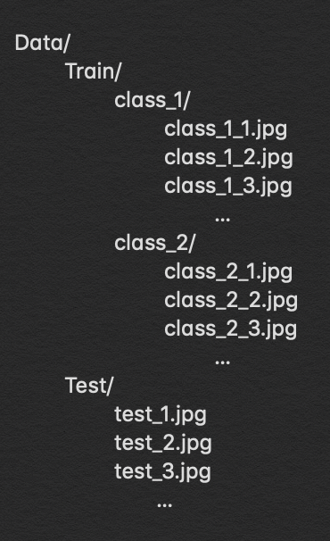

# Handling overfitting in CNN using keras ImageDataGenerator

During the CNN training, one of the most typical problems that one might occur includes the model overfitting. Also referred to as a high variance problem, overfitting represents when the model becomes "too complex" to fit the training data, thereby failing to generalize to the new set of data that has not been seen by the model during the training. 

As described in **<u>my other article</u>** "Model evaluation", the overfitting behavior can be detected by many diagnostic methods. During the CNN training using Keras framework, one may directly detect the model overfitting real-time by carefully monitoring various metrics of the learning model.

To handle the model overfitting, one may consider to implement:

- regularization and dropout
- batchnormalization
- data augmentation

Here in this article, detailed usage of the Keras data augmentation method is explored. The `ImageDataGenerator` class invovles ***data preprocessing, on-the-fly data augmentation and feeding in one step***. While these steps can be carried rather manually using other frameworks like openCV, the `ImageDataGenerator` class in Keras provides a really easy way to achieve the goal with the minimal efforts.

## Importing the module

```python
from keras.preprocessing.image import ImageDataGenerator
```

`ImageDataGenerator` generates batches of tensor with real-time data augmentation. The data will be looped over in batches. There are two typical types of a generator created based on the nature/structure of the available dataset.

1. When all images are already resized and loaded in memory as numpy tensors (***in-memory***)
2. When images are directly fed from disk and resized on-the-fly (***on-disk***)

## Define/fit an *in-memory* generator

Prior to building a in-memory generator, the dataset needs to be resized and splited into training, validation and test sets (i.e. using sklearn's `train_test_split`. While the full list of arguments for preprocessing and augmentation can be found in the official keras document ([here](https://keras.io/preprocessing/image/)), some popular arguments for the in-memory generator include:

* `rotation_range`: the range of random rotation degree
* `horizontal_flip` and `vertical_flip`: True or False for random flips
* `preprocessing_funtion`: function that will be implied on each input after all other resize and augmentation. Typically used when building transfer learning models

example code snippit:

```python
train_datagen = ImageDataGenerator(rotation_range=20,
                                   width_shift_range=0.2,
                                   rotation_range=20,
                                   horizontal_flip=True)
train_datagen.fit(X_train)  #(1) 
#(2)
train_generator = train_datagen.flow(X_train,y_train,batch_size=batch_size,shuffle=True) #(3)
hist = model.fit_generator(train_generator,
                           steps_per_epoch=len(X_train)//train_generator.batch_size,
                           epochs=epochs,
                           validation_data=(X_valid,y_valid)) #(4)
model.evaluate(X_test,y_test) #(5)
```

(1) only necessary if some arguments are used that require data-dependent transformation (i.e. `featurewise_center`,`featureise_std_normalization`,`zca_whitening`, etc)

(2) `flow` method is used here

(3) `shuffle=True` ensures that the data is randomly shuffled at the beginning of each epoch

(4) fit the model on the pre-defined `batch-size` with real-time data-augmentation

(5) evalate on a test set

## Define a *on-disk* generator

When the dataset is too large that cannot be stored in memory as a whole, this on-disk generator provides a way to continuously feed the model with a batch of data from the disk. Unlike the in-memory method, the on-disk method requires an user to pre-process the dataset directory as:

<p align="center"></p>

Labels are automatically created during the training by the name of the class folders. While the full list of arguments for preprocessing and augmentation can be found in the official keras document ([here](https://keras.io/preprocessing/image/)), some popular arguments that are particularly useful in the on-disk generator method include:

* `rescale`: rescaling factor which is multiplied after applying all other transformation. (i.e. 1./255 for image normalization)

example code snippit:

```python
train_datagen = ImageDataGenerator(rescale=1./255, #(1)
                                   rotation_range=20,
                                   width_shift_range=0.2,
                                   rotation_range=20,
                                   horizontal_flip=True)
train_datagen.fit(X_train)  #(2)
valid_test_datagen = ImageDataGenerator(rescale=1./255) #(3)
#(4)
train_generator = train_datagen.flow_from_directory(Train_path,
                                                    target_size=(img_width,img_height), #(5)
                                                    batch_size=batch_size,
                                                    class_mode='binary', #(6)
                                                    shuffle=True,
                                                    seed=0)
valid_generator = valid_test_datagen.flow_from_directory(Valid_path,
                                                    target_size=(img_width,img_height),
                                                    batch_size=batch_size,
                                                    class_mode='binary',
                                                    shuffle=True,
                                                         seed=0)
test_generator = valid_test_datagen.flow_from_directory(Test path,
                                                        target_size=(img_width,img_height), 
                                                        batch_size=1,
                                                        shuffle=True,
                                                        seed=0)
hist = model.fit_generator(train_generator,
                           steps_per_epoch=train_generator.n//train_generator.batch_size,
                           epochs=epochs,
                           validation_data=valid_generator,
                           validation_steps=valid_generator.n//valid_generator.batch_size)
model.evaluate_generator(test_generator,test_generator.n) #(7)
```

(1) Unlike the in-memory method, image rescaling is doen in real-time

(2) only necessary if some arguments are used that require data-dependent transformation (i.e. `featurewise_center`,`featureise_std_normalization`,`zca_whitening`, etc)

(3) Seperate datagen is defined for valid and test sets without any data augmentation arguments

(4) `flow_from_directory` method is used here

(5) Unlike the in-memory method, image resizing is doen in real-time

(6) `class_mode` needs to be set to either 'binary' or 'categorical'

(7) evalate on a test set

### Optional

For the use of the on-disk generator, train and valid sets can be combined here as (case 2):

<p align="center"></p>

In this case, one extra argument is used when defining the `ImageDataGenerator`:

* `validation_split`: fraction of training set that is to be used as validation set. Needed when the image directories are prepared as in case 2 above.

Example code snippit:

```python
train_datagen = ImageDataGenerator(rescale=1./255,
                                   rotation_range=20,
                                   width_shift_range=0.2,
                                   rotation_range=20,
                                   horizontal_flip=True,
                                   validation_split=0.2)
train_datagen.fit(X_train)
test_datagen = ImageDataGenerator(rescale=1./255) #(1)
train_generator = train_datagen.flow_from_directory(Train_path,
                                                    target_size=(img_width,img_height),
                                                    batch_size=batch_size,
                                                    class_mode='binary', 
                                                    subset='training', #(2) 
                                                    shuffle=True,
                                                    seed=0)
valid_generator = train_datagen.flow_from_directory(Train_path, #(3)
                                                    target_size=(img_width,img_height),
                                                    batch_size=batch_size,
                                                    class_mode='binary',
                                                    subset='validation', #(2)
                                                    shuffle=True,
                                                    seed=0)
test_generator = test_datagen.flow_from_directory(Test path,
                                                  target_size=(img_width,img_height),
                                                  batch_size=1,
                                                  shuffle=True,
                                                  seed=0)
hist = model.fit_generator(train_generator,
                           steps_per_epoch=train_generator.n//train_generator.batch_size,
                           epochs=epochs,
                           validation_data=valid_generator,
                           validation_steps=valid_generator.n//valid_generator.batch_size)
model.evaluate_generator(test_generator,test_generator.n)
```

(1) Seperate datagen is defined for a test set without any data augmentation arguments

(2) `subset` argument needs to be defined to indicate the type of generator

(3) same datagen and directory as training set

#### CAUTION: Here, the `valid_generator` was defined using the `train_datagen` where all the augmentation arguments were applied. I could not confirm myself yet that this optional method would not augment the validation set as well. To be followed up shortly.

#### NOTE: the `valid_generator` trick can also be used in the *in-memory* method. In this case, the dataset needs to be pre-splited into train and test sets only.

