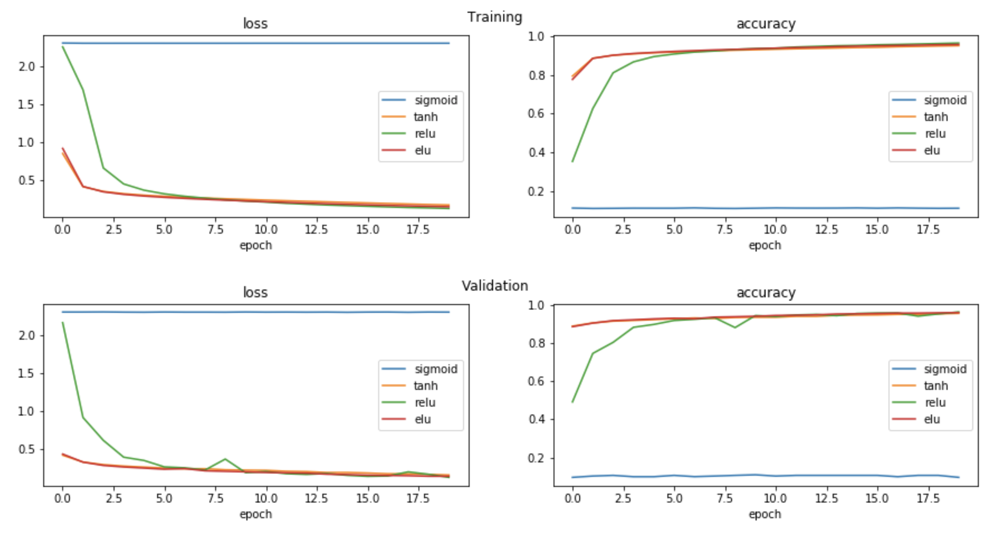

# ML_DL_articles_resources

This repository contains a collection of my personal articles on various topics of machine learning and deep learning research in python. 

###  [Exploring non-linear activation functions][5]

In a neural network, an activation function is an important transformer which enables a model to learn non-linearity. There are different types of activation function and their performance depends on many different factors. This article explores a few of today's most popular types of activation functions in a neural network: ***sigmoid***, ***tanh***, ***ReLU*** and ***ELU***. Some pros and cons of each function are described along with their mathematical backgrounds. Lastly, experimental results are presented comparing the performance of the models with different activation functions when fitting the MNIST dataset.

### [Preparing a customized image dataset from online sources][1]

One of the most crucial parts in general CNN/computer vision modelling problems is to have a good quality/quantity image dataset. Depending on the number of available training data and their quality (i.e. correctly labelled? contains a good representation of a class? contains different variations of each class? and etc.), very different models will be achieved with different performances. Among many, one of the easiest way to prepare one's own dataset is to collect them from online. This article describes one way of doing it using `google_images_download` module. With a list of specific search queries, collecting tens of thousands of images to build a customized training dataset becomes straightforward.

### [Handling overfitting in CNN using keras ImageDataGenerator][2]

When training a CNN model, one of the typical problems one may encounter is a model overfitting. It happens for several reasons and limits the performance of the model. Among many ways to resolve this issue, this article describes a way to implement ***data augmentation*** using keras' `ImageDataGenerator`. A few different scenarios where this class can be implemented are explored with actual code examples. 

### [Comparison studies (pros/cons) on various supervised machine learning models][3]

For typical supervised predictive modelling problems including regression and classification, there exist many different algorithms a practitioner can choose to use. Depending on the type of given problems, one algorithm tends to perform better than the others, but there is no one single algorithm that simply outperforms its counterparts in all different situations. This article explores some pros and cons of different supervised machine learning algorithms with least amount of maths involved. In these days, many high-level modules such as `scikit-learn` and `tensorflow` are available for a practitioner to build and test different algorithms with only a few lines of code. One may need to test a few before choosing and optimizing a single model to work with. 

### [Model evaluation][4]

Regardless of the type of predictive modelling problems on hands, a model is optimized over time based on specific metrics. Usually, a single number metric is preferred to evaluate the current model, but a metric needs to be carefully chosen depending on the problems one tries to solve. With a properly divided dataset (training, validation and test), then the metric can be used to evaluate if the current model is over- or under-fitting. This article describes how the typical model evaluation is performed and suggest some methods to optimize the model in different scenarios. Also, popular types of metrics in typical supervised learning situations (regression and classification) are explored.

[1]:https://github.com/sungsujaing/ML_DL_articles_resources/blob/master/Articles/Preparing%20your%20own%20image%20dataset.md
[2]: https://github.com/sungsujaing/ML_DL_articles_resources/blob/master/Articles/Handling%20overfitting%20in%20CNN%20using%20keras%20ImageDataGenerator.md
[3]: https://github.com/sungsujaing/ML_DL_articles_resources/blob/master/Articles/SupervisedML_ComparativeStudies.md
[4]:https://github.com/sungsujaing/ML_DL_articles_resources/blob/master/Articles/Model%20evaluation.md
[5]: https://github.com/sungsujaing/ML_DL_articles_resources/blob/master/Articles/Exploring%20non-linear%20activation%20functions.md