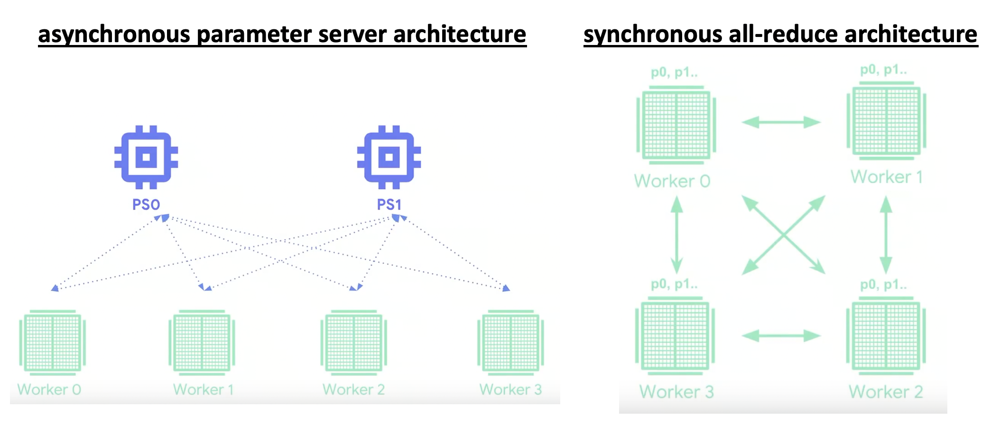
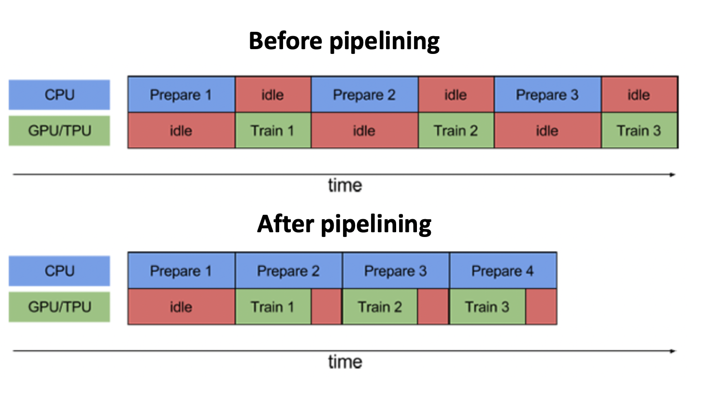
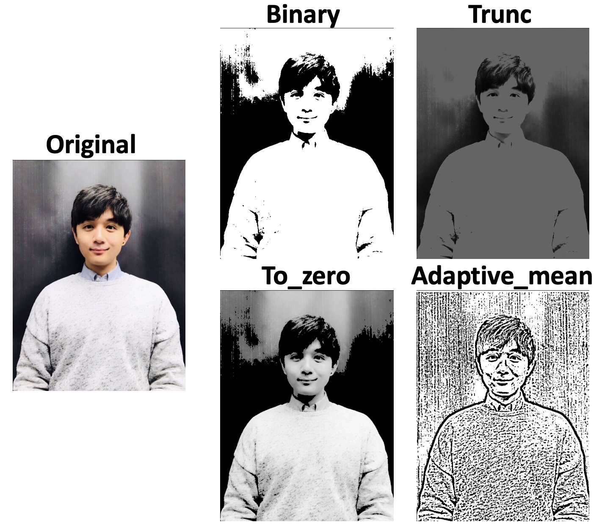
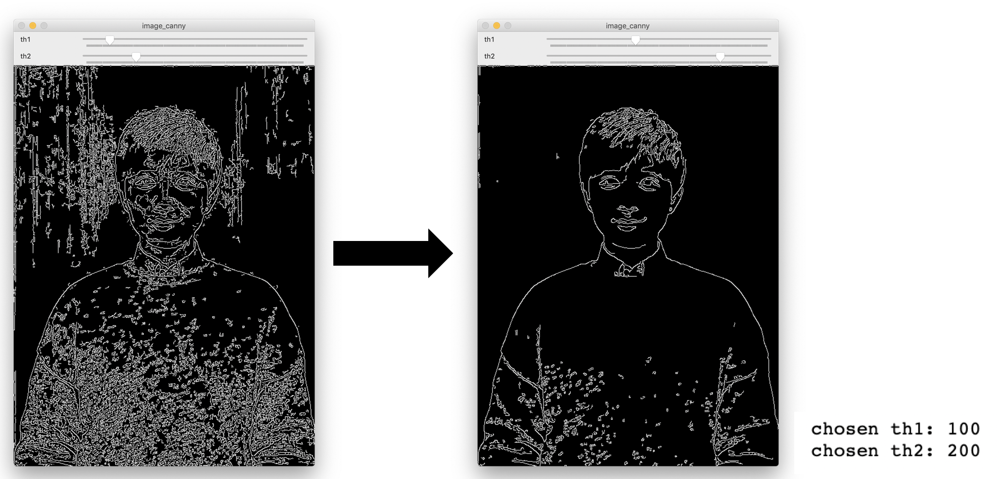
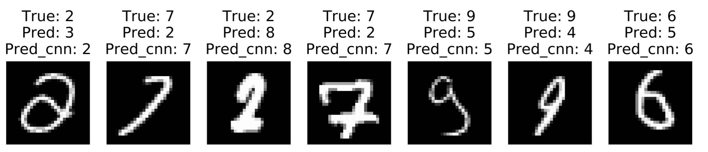
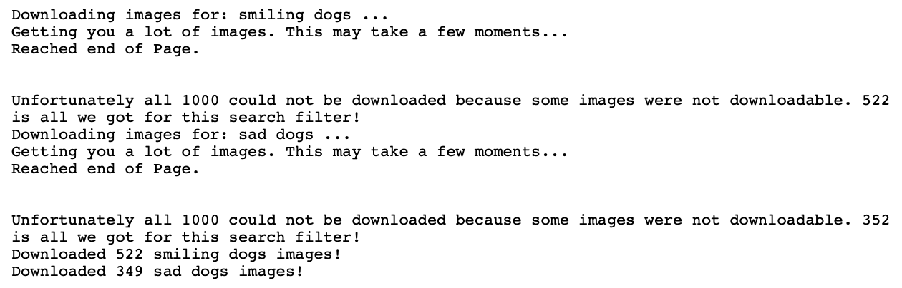
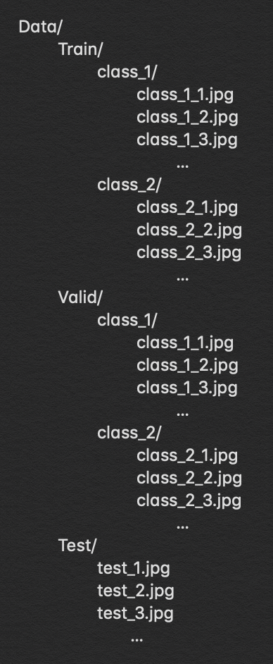
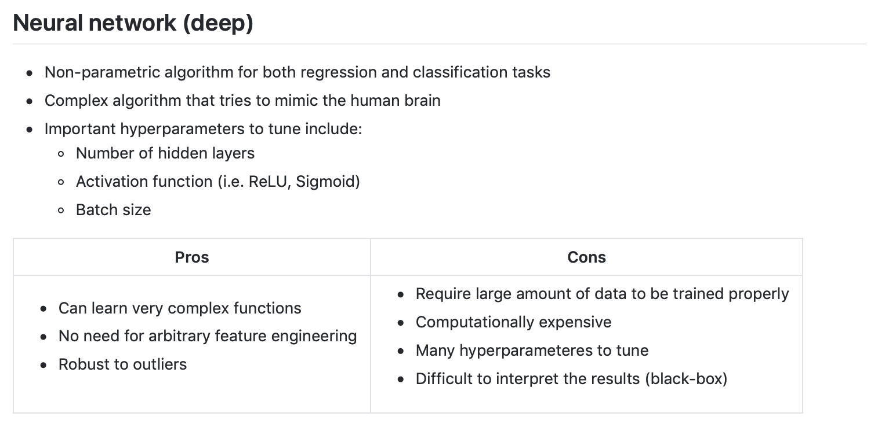
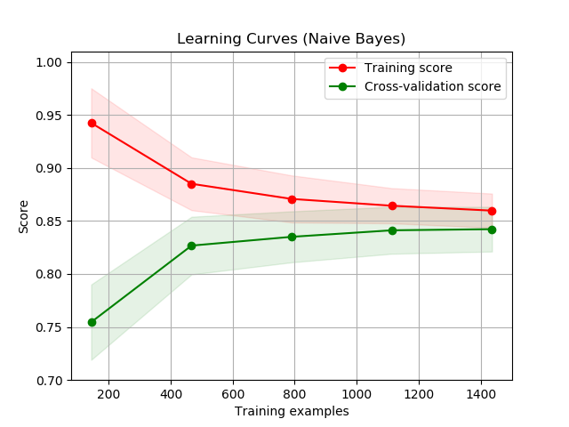
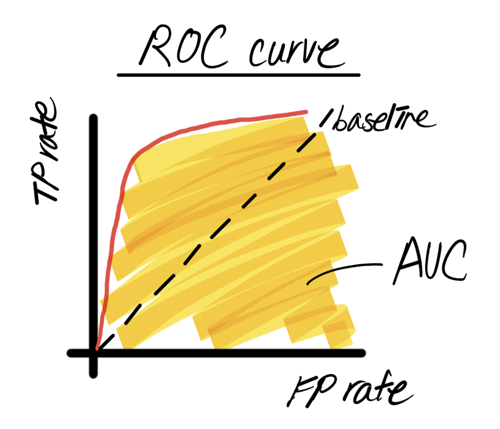

# Artificial Intelligence articles and tutorials

This repository contains a collection of my articles on various topics of AI (also DL/ML/DS) research in python. Some articles contain code examples for demonstration purposes and the links to the full version of the corresponding code can be found in each article.

## Current list of topics
* [**Exploring distributed training with Keras and TensorFlow data module**](#exploring-distributed-training-with-keras-and-tensorflow-data-module-or-code)
* [**Exploring GAN, WGAN and StyleGAN**](#exploring-gan-wgan-and-stylegan-or-code)
* [**OpenCV basics in python (Jupyter notebook)**](#opencv-basics-in-python-jupyter-notebook-or-code)
* [**Face recognition using OpenFace**](#face-recognition-using-openface-or-code)
* [**Training and running Yolo on Jupyter notebook (TensorFlow)**](#training-and-running-yolo-on-jupyter-notebook-tensorflow)
* [**Exploring non-linear activation functions**](#exploring-non-linear-activation-functions-or-code)
* [**Preparing a customized image dataset from online sources**](#preparing-a-customized-image-dataset-from-online-sources)
* [**Handling overfitting in CNN using keras ImageDataGenerator**](#handling-overfitting-in-cnn-using-keras-imagedatagenerator)
* [**Comparison studies (pros and cons) on various supervised machine learning models**](#comparison-studies-pros-and-cons-on-various-supervised-machine-learning-models)
* [**Model evaluation**](#model-evaluation)

## Upcoming topics

* Defining custom loss and custom layers on TensorFlow2.0 using `GradientTape`
* TensorFlow Lite for mobile/embedded deployment
* etc.

## Summaries
### [Exploring distributed training with Keras and TensorFlow data module][10] (or [*Code*](https://github.com/sungsujaing/ML_DL_articles_resources/blob/master/Code%20appendix/Exploring%20distributed%20training%20with%20keras%20and%20tensorflow%20data%20module.ipynb))

When a relatively small amount of data is on hand to train a relatively simple model with a single processing unit (CPU, GPU or TPU), training may not take too much time and a practitioner can go through several rounds of trial-and-error to optimize their models. When the amount of data gets bigger or the model gets complicated, training becomes computationally expensive and the corresponding training may take a few hours, days, even weeks, making the overall model development process very inefficient. The solution is **distributed training** or going parallel with multiple processing units (or even workers)! This article introduces the needs and importance of distributed training, and explores `tf.distribute.Strategy` and `tf.data` modules with actual code examples to understand how the TensorFlow's high-level API  `tf.keras` can be tweaked to enable the distributed training with minimal changes in its user-friendly models/codes.

  
  

### [Exploring GAN, WGAN and StyleGAN][9] (or [*Code*](https://github.com/sungsujaing/ML_DL_articles_resources/blob/master/Code%20appendix/Fashion_image_generator_using_GAN%20and%20WGAN.ipynb))

**GAN (Generative and Adversarial Network)** is one of the recent technologies in the field of deep learning that is pushing the threshold of deep-learning-based generative models in many different domains. Since its [first introduction in 2014](https://arxiv.org/pdf/1406.2661.pdf), there has been a number of [interesting variations/applications](https://github.com/nashory/gans-awesome-applications#anime-character-generation) made from GAN. This article would like to explore the theoretical backgrounds of the basic GAN model (in terms of images) and introduce practical code examples to generate the fashion_MNIST-like images from scratch. At the end of this article, WGAN (Wasserstein Generative and Adversarial Network) and NVIDIA's StyleGan are briefly explored as well.

#### GAN Structure

#### GAN training summary

	
	

#### StyleGAN fake human face generation (or [*Code*](https://github.com/sungsujaing/ML_DL_articles_resources/blob/master/Code%20appendix/NVIDIA_StyleGAN_face_gen_example.ipynb))

### [OpenCV basics in python (Jupyter notebook)][8] (or [*Code*](https://github.com/sungsujaing/ML_DL_articles_resources/blob/master/Code%20appendix/OpenCV_tutorial.ipynb))

**OpenCV** is a powerful open-source tool that can be used in a variety of deep learning projects involving images and videos (in the field of computer vision). This article explores the basic/fundamental uses of this library in Python, especially in the Jupyter notebook environment. The purpose of this article is to provide the practical examples of the usages of some basic OpenCV algorithms on images and videos so that one can build upon the custom projects more easily.

### [Face recognition using OpenFace][7] (or [*Code*](https://github.com/sungsujaing/TV_time_tracking_face_recognition))

**Face recognition** is an interesting and very powerful application of a convolution neural network (CNN). It is the ubiquitous technology that can be used for many different purposes (i.e. to claim identification at the entrance, to track the motion of specific individuals, etc.). This article explores the theoretical background of popular face recognition systems and also introduce the practical way of implementing FaceNet model on Keras (with TensorFlow backend) with a custom dataset.

### [Training and running Yolo on Jupyter notebook (TensorFlow)][6]

**YOLO (You Only Look Once)** is one of the most popular state-of-the-art one-stage object detectors out in the field. Unlike other typical two-stage object detectors like R-CNN, YOLO looks at the entire image once (with a single neural network) to localize/classify the objects that it was trained for. 

The original YOLO algorithm is implemented in [darknet](https://github.com/pjreddie/darknet) framework by Joseph Redmon. This open-source framework is written in C and CUDA, and therefore a new framework called [**darkflow**](https://github.com/thtrieu/darkflow) has been introduced to implement YOLO on TensorFlow. This article describes the practical step-by-step process of configuring, running, and training custom YOLO on Jupyter notebook and TensorFlow.

### [Exploring non-linear activation functions][5] (or [*Code*](https://github.com/sungsujaing/ML_DL_articles_resources/blob/master/Code%20appendix/Activation_funtion_experiment.ipynb))

In a neural network, an activation function is an important transformer which enables a model to learn non-linearity. There are different types of activation function and their performance depends on many different factors. This article explores a few of today's most popular types of activation functions in a neural network: ***sigmoid***, ***tanh***, ***ReLU*** and ***ELU***. Some pros and cons of each function are described along with their mathematical backgrounds. Lastly, experimental results are presented comparing the performance of the models with different activation functions when fitting the simple MNIST dataset (both on arbitrarily-built NN and CNN architectures).

### [Preparing a customized image dataset from online sources][1]

One of the most crucial parts in general CNN/computer vision modelling problems is to have a good quality/quantity image dataset. Depending on the number of available training data and their quality (i.e. correctly labelled? contains a good representation of a class? contains different variations of each class? and etc.), very different models will be achieved with different performances. Among many, one of the easiest way to prepare one's own dataset is to collect them from online. This article describes one way of doing it using `google_images_download` module. With a list of specific search queries, collecting tens of thousands of images to build a customized training dataset becomes straightforward.

### [Handling overfitting in CNN using keras ImageDataGenerator][2]

When training a CNN model, one of the typical problems one may encounter is a model overfitting. It happens for several reasons and limits the performance of the model. Among many ways to resolve this issue, this article describes a way to implement ***data augmentation*** using keras' `ImageDataGenerator`. A few different scenarios where this class can be implemented are explored with actual code examples.

### [Comparison studies (pros and cons) on various supervised machine learning models][3]

For typical supervised predictive modelling problems including regression and classification, there exist many different algorithms a practitioner can choose to use. Depending on the type of given problems, one algorithm tends to perform better than the others, but there is no one single algorithm that simply outperforms its counterparts in all different situations. This article explores some pros and cons of different supervised machine learning algorithms with least amount of maths involved. In these days, many high-level modules such as `scikit-learn` and `TensorFlow` are available for a practitioner to build and test different algorithms with only a few lines of code. One may need to test a few before choosing and optimizing a single model to work with.

### [Model evaluation][4]

Regardless of the type of predictive modelling problems on hands, a model is optimized over time based on specific metrics. Usually, a single number metric is preferred to evaluate the current model, but a metric needs to be carefully chosen depending on the problems one tries to solve. With a properly divided dataset (training, validation and test), then the metric can be used to evaluate if the current model is over- or under-fitting. This article describes how the typical model evaluation is performed and suggest some methods to optimize the model in different scenarios. Also, popular types of metrics in typical supervised learning situations (regression and classification) are explored.

[1]:https://github.com/sungsujaing/ML_DL_articles_resources/blob/master/Articles/Preparing%20your%20own%20image%20dataset.md
[2]: https://github.com/sungsujaing/ML_DL_articles_resources/blob/master/Articles/Handling%20overfitting%20in%20CNN%20using%20keras%20ImageDataGenerator.md
[3]: https://github.com/sungsujaing/ML_DL_articles_resources/blob/master/Articles/SupervisedML_ComparativeStudies.md
[4]:https://github.com/sungsujaing/ML_DL_articles_resources/blob/master/Articles/Model%20evaluation.md
[5]: https://github.com/sungsujaing/ML_DL_articles_resources/blob/master/Articles/Exploring%20non-linear%20activation%20functions.md

[6]: https://github.com/sungsujaing/ML_DL_articles_resources/blob/master/Articles/Training%20and%20running%20Yolo%20on%20Jupyter%20notebook%20(tensorflow).md

[7]: https://github.com/sungsujaing/ML_DL_articles_resources/blob/master/Articles/Face%20recognition%20using%20OpenFace.md

[8]: https://github.com/sungsujaing/ML_DL_articles_resources/blob/master/Articles/OpenCV%20basics%20in%20python.md

[9]: https://github.com/sungsujaing/ML_DL_articles_resources/blob/master/Articles/Exploring%20GAN%2C%20WGAN%20and%20StyleGAN.md

[10]: https://github.com/sungsujaing/ML_DL_articles_resources/blob/master/Articles/Exploring%20distributed%20training%20with%20Keras%20and%20TensorFlow%20data%20module.md
